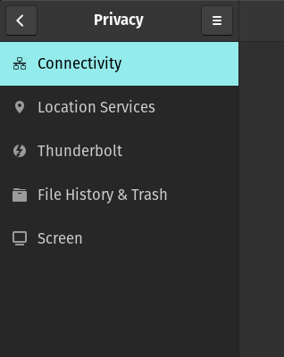

### Scripts version 9 Running Logs

snippets logs from scripts execution

```bash
[ipu6_install_v9] Installing userspace (libcamera, HAL, v4l2loopback, v4l2-relayd)…
Reading package lists... Done
Building dependency tree... Done
Reading state information... Done
E: Unable to locate package gstreamer1.0-libcamera
E: Couldn't find any package by glob 'gstreamer1.0-libcamera'
E: Couldn't find any package by regex 'gstreamer1.0-libcamera'
....
Package libspa-0.2-libcamera is not available, but is referred to by another package.
This may mean that the package is missing, has been obsoleted, or
is only available from another source

E: Package 'libspa-0.2-libcamera' has no installation candidate
[ipu6_install_v9] Configuring v4l2loopback…
modprobe: FATAL: Module v4l2loopback not found in directory /lib/modules/6.16.3-76061603-generic

```

Logs from checkout commands run after scripts execution

```bash
➜  SamsungGalaxyNote git:(main) ✗ libcamera-hello --list-cameras
zsh: command not found: libcamera-hello
➜  SamsungGalaxyNote git:(main) ✗ v4l2-ctl --all -d /dev/video10
Driver Info:
        Driver name      : isys
        Card type        : ipu6
        Bus info         : PCI:0000:00:05.0
        Driver version   : 6.16.3
        Capabilities     : 0xa4a00001
                Video Capture
                Metadata Capture
                I/O MC
                Streaming
                Extended Pix Format
                Device Capabilities
        Device Caps      : 0x24a00001
                Video Capture
                Metadata Capture
                I/O MC
                Streaming
                Extended Pix Format
Media Driver Info:
        Driver name      : intel-ipu6
        Model            : ipu6
        Serial           : 
        Bus info         : PCI:0000:00:05.0
        Media version    : 6.16.3
        Hardware revision: 0x144dc1d8 (340640216)
        Driver version   : 6.16.3
Interface Info:
        ID               : 0x0300002b
        Type             : V4L Video
Entity Info:
        ID               : 0x00000029 (41)
        Name             : Intel IPU6 ISYS Capture 10
        Function         : V4L2 I/O
        Pad 0x0100002a   : 0: Sink, Must Connect
          Link 0x02000111: from remote pad 0x10000cf of entity 'Intel IPU6 CSI2 1' (Video Interface Bridge): Data
Priority: 2
Video input : 0 (Intel IPU6 ISYS Capture 10: ok)
Format Video Capture:
        Width/Height      : 1920/1080
        Pixel Format      : 'BG12' (12-bit Bayer BGBG/GRGR)
        Field             : None
        Bytes per Line    : 3840
        Size Image        : 4151040
        Colorspace        : Raw
        Transfer Function : Default (maps to None)
        YCbCr/HSV Encoding: Default (maps to ITU-R 601)
        Quantization      : Default (maps to Full Range)
        Flags             : 
Format Metadata Capture:
        Sample Format   : 'MET8' (8-bit Generic Metadata)
        Buffer Size     : 9600

```

Log snippets from `dmsg` command

```bash

[    9.790814] intel-ipu6 0000:00:05.0: Found supported sensor OVTI02C1:00
[    9.790887] intel-ipu6 0000:00:05.0: Connected 1 cameras
[    9.792670] intel-ipu6 0000:00:05.0: Sending BOOT_LOAD to CSE
[    9.793186] intel_vpu 0000:00:0b.0: [drm] Firmware: intel/vpu/vpu_37xx_v1.bin, version: 20250115*MTL_CLIENT_SILICON-release*1905*ci_tag_ud202504_vpu_rc_20250115_1905*ae83b65d01c
[    9.793189] intel_vpu 0000:00:0b.0: [drm] Scheduler mode: HW
[    9.808589] ACPI: battery: new hook: Samsung Galaxy Book Battery Extension
[    9.826763] input: Samsung Galaxy Book Camera Lens Cover as /devices/platform/SAM0430:00/input/input26

```

print screen of evidences that web do not work



### Scripts version 10 Running Logs

snippets logs from scripts execution
```bash
➜  SamsungGalaxyNote git:(main) ✗ sudo ./ipu6_install_v10.sh
[ipu6_install_v10] Preflight…
Hit:1 https://download.docker.com/linux/ubuntu jammy InRelease
Get:2 https://repo.steampowered.com/steam stable InRelease [3,622 B]                                                                                                                                                                                                                                         
Hit:3 https://dl.google.com/linux/chrome/deb stable InRelease                                                                                                                                                                                                                                                         
Hit:4 http://archive.ubuntu.com/ubuntu jammy-updates InRelease                                                                                                                                                                                     
Hit:5 http://apt.pop-os.org/proprietary jammy InRelease                                                                                                                                      
Hit:6 https://downloads.1password.com/linux/debian/amd64 stable InRelease                                                                                              
Hit:7 https://repo.nordvpn.com//deb/nordvpn/debian stable InRelease                                             
Hit:8 http://apt.pop-os.org/release jammy InRelease                                       
Ign:9 https://apt.fury.io/notion-repackaged  InRelease              
Hit:10 http://apt.pop-os.org/ubuntu jammy InRelease                 
Ign:11 https://apt.fury.io/notion-repackaged  Release
Hit:12 https://ppa.launchpadcontent.net/oem-solutions-group/intel-ipu6/ubuntu jammy InRelease
Ign:13 https://apt.fury.io/notion-repackaged  Packages              
Hit:14 http://apt.pop-os.org/ubuntu jammy-security InRelease
Ign:15 https://apt.fury.io/notion-repackaged  Translation-en
Hit:16 http://apt.pop-os.org/ubuntu jammy-updates InRelease
Ign:17 https://apt.fury.io/notion-repackaged  Translation-en_US
Get:13 https://apt.fury.io/notion-repackaged  Packages [1,572 B]
Hit:18 http://apt.pop-os.org/ubuntu jammy-backports InRelease         
Ign:15 https://apt.fury.io/notion-repackaged  Translation-en
Ign:17 https://apt.fury.io/notion-repackaged  Translation-en_US
Ign:15 https://apt.fury.io/notion-repackaged  Translation-en
Ign:17 https://apt.fury.io/notion-repackaged  Translation-en_US
Ign:15 https://apt.fury.io/notion-repackaged  Translation-en
Ign:17 https://apt.fury.io/notion-repackaged  Translation-en_US
Ign:15 https://apt.fury.io/notion-repackaged  Translation-en
Ign:17 https://apt.fury.io/notion-repackaged  Translation-en_US
Ign:15 https://apt.fury.io/notion-repackaged  Translation-en
Ign:17 https://apt.fury.io/notion-repackaged  Translation-en_US
Ign:15 https://apt.fury.io/notion-repackaged  Translation-en
Ign:17 https://apt.fury.io/notion-repackaged  Translation-en_US
Fetched 5,194 B in 4s (1,371 B/s)
Reading package lists... Done
Reading package lists... Done
Building dependency tree... Done
Reading state information... Done
ca-certificates is already the newest version (20240203~22.04.1).
curl is already the newest version (7.81.0-1ubuntu1.20).
gnupg is already the newest version (2.2.27-3ubuntu2.4).
software-properties-common is already the newest version (0.99.22.9).
wget is already the newest version (1.21.2-2ubuntu1.1).
linux-headers-6.16.3-76061603-generic is already the newest version (6.16.3-76061603.202508231538~1758561135~22.04~171c8de).
build-essential is already the newest version (12.9ubuntu3).
pkg-config is already the newest version (0.29.2-1ubuntu3).
gstreamer1.0-plugins-bad is already the newest version (1.24.13-0ubuntu1~22.04.sav0.1).
gstreamer1.0-plugins-base is already the newest version (1.24.13-0ubuntu1~22.04.sav0).
gstreamer1.0-plugins-good is already the newest version (1.24.13-0ubuntu1~22.04.sav0.1).
gstreamer1.0-tools is already the newest version (1.24.13-0ubuntu1~22.04.sav0).
v4l-utils is already the newest version (1.26.1-2~22.04.sav0).
0 upgraded, 0 newly installed, 0 to remove and 0 not upgraded.
[ipu6_install_v10] Ensure Intel IPU6 PPA present and userspace installed…
Hit:1 https://download.docker.com/linux/ubuntu jammy InRelease
Get:2 https://repo.steampowered.com/steam stable InRelease [3,622 B]                                                                                                                                                                                                                                                  
Hit:3 https://dl.google.com/linux/chrome/deb stable InRelease                                                                                                                                                                                                                                                         
Hit:4 https://repo.nordvpn.com//deb/nordvpn/debian stable InRelease                                                                                                                                                                                                                                        
Hit:5 http://apt.pop-os.org/proprietary jammy InRelease                                                                                                                                                                      
Hit:6 http://archive.ubuntu.com/ubuntu jammy-updates InRelease                                                                                     
Hit:7 https://downloads.1password.com/linux/debian/amd64 stable InRelease                                                                          
Hit:8 http://apt.pop-os.org/release jammy InRelease                                       
Ign:9 https://apt.fury.io/notion-repackaged  InRelease              
Ign:10 https://apt.fury.io/notion-repackaged  Release               
Hit:11 http://apt.pop-os.org/ubuntu jammy InRelease                 
Ign:12 https://apt.fury.io/notion-repackaged  Packages              
Hit:13 https://ppa.launchpadcontent.net/oem-solutions-group/intel-ipu6/ubuntu jammy InRelease
Hit:14 http://apt.pop-os.org/ubuntu jammy-security InRelease
Ign:15 https://apt.fury.io/notion-repackaged  Translation-en
Hit:16 http://apt.pop-os.org/ubuntu jammy-updates InRelease
Ign:17 https://apt.fury.io/notion-repackaged  Translation-en_US
Get:12 https://apt.fury.io/notion-repackaged  Packages [1,572 B]
Hit:18 http://apt.pop-os.org/ubuntu jammy-backports InRelease         
Ign:15 https://apt.fury.io/notion-repackaged  Translation-en
Ign:17 https://apt.fury.io/notion-repackaged  Translation-en_US
Ign:15 https://apt.fury.io/notion-repackaged  Translation-en
Ign:17 https://apt.fury.io/notion-repackaged  Translation-en_US
Ign:15 https://apt.fury.io/notion-repackaged  Translation-en
Ign:17 https://apt.fury.io/notion-repackaged  Translation-en_US
Ign:15 https://apt.fury.io/notion-repackaged  Translation-en
Ign:17 https://apt.fury.io/notion-repackaged  Translation-en_US
Ign:15 https://apt.fury.io/notion-repackaged  Translation-en
Ign:17 https://apt.fury.io/notion-repackaged  Translation-en_US
Ign:15 https://apt.fury.io/notion-repackaged  Translation-en
Ign:17 https://apt.fury.io/notion-repackaged  Translation-en_US
Fetched 5,194 B in 4s (1,391 B/s)
Reading package lists... Done
Reading package lists... Done
Building dependency tree... Done
Reading state information... Done
[ipu6_install_v10] Installing icamerasrc (GStreamer) if available…
Reading package lists... Done
Building dependency tree... Done
Reading state information... Done
E: Unable to locate package gstreamer1.0-icamerasrc
E: Couldn't find any package by glob 'gstreamer1.0-icamerasrc'
E: Couldn't find any package by regex 'gstreamer1.0-icamerasrc'
[ipu6_install_v10] Verify kernel IPU6 modules…
IPU6 kernel modules not loaded. Check dmesg for IPU6 errors and verify firmware.
```

### Scripts version 11 Running Logs

```bash
➜  SamsungGalaxyNote git:(main) ✗ sudo ./ipu6_install_v11.sh
[sudo] password for fernandoavanzo: 
[ipu6_install_v11] Kernel: 6.16.3-76061603-generic
Get:1 https://repo.steampowered.com/steam stable InRelease [3,622 B]
Hit:2 https://dl.google.com/linux/chrome/deb stable InRelease                                                                                                                                                                           
Hit:3 http://archive.ubuntu.com/ubuntu jammy-updates InRelease                                                                                                                                                                                               
Hit:4 https://download.docker.com/linux/ubuntu jammy InRelease                                                                                                                                                                                               
Hit:5 https://repo.nordvpn.com//deb/nordvpn/debian stable InRelease                                                                                                                                                             
Hit:6 http://apt.pop-os.org/proprietary jammy InRelease                                                                                                             
Hit:7 http://apt.pop-os.org/release jammy InRelease                                                                                           
Hit:8 http://apt.pop-os.org/ubuntu jammy InRelease                                                                                          
Hit:9 https://downloads.1password.com/linux/debian/amd64 stable InRelease                 
Ign:10 https://apt.fury.io/notion-repackaged  InRelease                                   
Get:11 https://ppa.launchpadcontent.net/oem-solutions-group/intel-ipu6/ubuntu jammy InRelease [18.3 kB]
Ign:12 https://apt.fury.io/notion-repackaged  Release                            
Ign:13 https://apt.fury.io/notion-repackaged  Packages                           
Hit:14 http://apt.pop-os.org/ubuntu jammy-security InRelease
Ign:15 https://apt.fury.io/notion-repackaged  Translation-en_US
Ign:16 https://apt.fury.io/notion-repackaged  Translation-en
Hit:17 http://apt.pop-os.org/ubuntu jammy-updates InRelease
Get:13 https://apt.fury.io/notion-repackaged  Packages [1,572 B]
Hit:18 http://apt.pop-os.org/ubuntu jammy-backports InRelease         
Ign:15 https://apt.fury.io/notion-repackaged  Translation-en_US
Ign:16 https://apt.fury.io/notion-repackaged  Translation-en
Ign:15 https://apt.fury.io/notion-repackaged  Translation-en_US
Ign:16 https://apt.fury.io/notion-repackaged  Translation-en
Ign:15 https://apt.fury.io/notion-repackaged  Translation-en_US
Ign:16 https://apt.fury.io/notion-repackaged  Translation-en
Ign:15 https://apt.fury.io/notion-repackaged  Translation-en_US
Ign:16 https://apt.fury.io/notion-repackaged  Translation-en
Ign:15 https://apt.fury.io/notion-repackaged  Translation-en_US
Ign:16 https://apt.fury.io/notion-repackaged  Translation-en
Ign:15 https://apt.fury.io/notion-repackaged  Translation-en_US
Ign:16 https://apt.fury.io/notion-repackaged  Translation-en
Fetched 23.5 kB in 3s (7,162 B/s)
Reading package lists... Done
Reading package lists... Done
Building dependency tree... Done
Reading state information... Done
ca-certificates is already the newest version (20240203~22.04.1).
cmake is already the newest version (3.22.1-1ubuntu1.22.04.2).
curl is already the newest version (7.81.0-1ubuntu1.20).
git is already the newest version (1:2.34.1-1ubuntu1.15).
gnupg is already the newest version (2.2.27-3ubuntu2.4).
libdw-dev is already the newest version (0.186-1ubuntu0.1).
libdw-dev set to manually installed.
libglib2.0-dev is already the newest version (2.72.4-0ubuntu2.6).
libglib2.0-dev set to manually installed.
libunwind-dev is already the newest version (1.3.2-2build2.1).
libunwind-dev set to manually installed.
python3 is already the newest version (3.10.6-1~22.04.1).
software-properties-common is already the newest version (0.99.22.9).
libdrm-dev is already the newest version (2.4.125-1pop0~1755787023~22.04~8d3aa51).
ninja-build is already the newest version (1.10.1-1pop1~1755790902~22.04~942aa8c).
libudev-dev is already the newest version (249.11-0ubuntu3.16pop0~1749652895~22.04~34f0ce1).
libudev-dev set to manually installed.
build-essential is already the newest version (12.9ubuntu3).
pkg-config is already the newest version (0.29.2-1ubuntu3).
python3-yaml is already the newest version (5.4.1-1ubuntu1).
meson is already the newest version (0.61.2-1).
gstreamer1.0-plugins-bad is already the newest version (1.24.13-0ubuntu1~22.04.sav0.1).
gstreamer1.0-plugins-base is already the newest version (1.24.13-0ubuntu1~22.04.sav0).
gstreamer1.0-plugins-good is already the newest version (1.24.13-0ubuntu1~22.04.sav0.1).
gstreamer1.0-tools is already the newest version (1.24.13-0ubuntu1~22.04.sav0).
v4l-utils is already the newest version (1.26.1-2~22.04.sav0).
Some packages could not be installed. This may mean that you have
requested an impossible situation or if you are using the unstable
distribution that some required packages have not yet been created
or been moved out of Incoming.
The following information may help to resolve the situation:

The following packages have unmet dependencies:
 libdeflate-dev : Depends: libdeflate0 (= 1.10-2) but 1.23-1~22.04.sav0 is to be installed
 libgmp-dev : Depends: libgmp10 (= 2:6.2.1+dfsg-3ubuntu1) but 2:6.3.0+dfsg-2ubuntu4~22.04.sav0 is to be installed
 libjpeg-turbo8-dev : Depends: libjpeg-turbo8 (= 2.1.2-0ubuntu1) but 2.1.5-2ubuntu1~22.04.sav0 is to be installed
 libyaml-dev : Depends: libyaml-0-2 (= 0.2.2-1build2) but 0.2.5-1~22.04.sav0 is to be installed
E: Unable to correct problems, you have held broken packages.
```
### Scripts version 12 Running Logs

```bash
➜  SamsungGalaxyNote git:(main) ✗ sudo ./ipu6_install_v12.sh
[sudo] password for fernandoavanzo: 
[ipu6_install_v12] Kernel: 6.16.3-76061603-generic
[ipu6_install_v12] intel_ipu6 modules not loaded. Please reboot into the kernel where they load (your 6.16 does). Abort.
```

### Scripts version 13 Running Logs

```bash
➜  SamsungGalaxyNote git:(main) ✗ sudo ./ipu6_install_v13.sh    
[sudo] password for fernandoavanzo: 
[ipu6_install_v13] Kernel: 6.16.3-76061603-generic
Get:1 https://repo.steampowered.com/steam stable InRelease [3,622 B]
Hit:2 https://dl.google.com/linux/chrome/deb stable InRelease                                                                                                                                                                                       
Hit:3 https://download.docker.com/linux/ubuntu jammy InRelease                                                                                                                                                                                                                            
Hit:4 https://repo.nordvpn.com//deb/nordvpn/debian stable InRelease                                                                                                                                                                                                                       
Hit:5 http://archive.ubuntu.com/ubuntu jammy-updates InRelease                                                                                                                                                                                                        
Hit:6 http://apt.pop-os.org/proprietary jammy InRelease                                                                                                                                                 
Ign:7 https://apt.fury.io/notion-repackaged  InRelease                                                                                                      
Hit:8 http://apt.pop-os.org/release jammy InRelease                                       
Ign:9 https://apt.fury.io/notion-repackaged  Release                                      
Hit:10 https://downloads.1password.com/linux/debian/amd64 stable InRelease                
Ign:11 https://apt.fury.io/notion-repackaged  Packages              
Ign:12 https://apt.fury.io/notion-repackaged  Translation-en        
Hit:13 http://apt.pop-os.org/ubuntu jammy InRelease
Get:14 https://ppa.launchpadcontent.net/oem-solutions-group/intel-ipu6/ubuntu jammy InRelease [18.3 kB]
Ign:15 https://apt.fury.io/notion-repackaged  Translation-en_US                  
Get:11 https://apt.fury.io/notion-repackaged  Packages [1,572 B]                 
Get:16 http://apt.pop-os.org/ubuntu jammy-security InRelease [129 kB]
Ign:12 https://apt.fury.io/notion-repackaged  Translation-en
Ign:15 https://apt.fury.io/notion-repackaged  Translation-en_US
Ign:12 https://apt.fury.io/notion-repackaged  Translation-en
Ign:15 https://apt.fury.io/notion-repackaged  Translation-en_US
Get:17 http://apt.pop-os.org/ubuntu jammy-updates InRelease [128 kB]
Ign:12 https://apt.fury.io/notion-repackaged  Translation-en
Ign:15 https://apt.fury.io/notion-repackaged  Translation-en_US
Ign:12 https://apt.fury.io/notion-repackaged  Translation-en
Ign:15 https://apt.fury.io/notion-repackaged  Translation-en_US
Ign:12 https://apt.fury.io/notion-repackaged  Translation-en
Get:18 http://apt.pop-os.org/ubuntu jammy-backports InRelease [127 kB]
Ign:15 https://apt.fury.io/notion-repackaged  Translation-en_US
Get:19 http://apt.pop-os.org/ubuntu jammy-security/main amd64 DEP-11 Metadata [54.4 kB]
Get:20 http://apt.pop-os.org/ubuntu jammy-security/restricted amd64 DEP-11 Metadata [208 B]
Get:21 http://apt.pop-os.org/ubuntu jammy-security/universe amd64 DEP-11 Metadata [126 kB]
Ign:12 https://apt.fury.io/notion-repackaged  Translation-en                                     
Get:22 http://apt.pop-os.org/ubuntu jammy-security/multiverse amd64 DEP-11 Metadata [208 B]       
Get:23 http://apt.pop-os.org/ubuntu jammy-updates/main amd64 DEP-11 Metadata [112 kB]
Ign:15 https://apt.fury.io/notion-repackaged  Translation-en_US                                   
Get:24 http://apt.pop-os.org/ubuntu jammy-updates/restricted amd64 DEP-11 Metadata [212 B]
Get:25 http://apt.pop-os.org/ubuntu jammy-updates/universe amd64 DEP-11 Metadata [359 kB]
Get:26 http://apt.pop-os.org/ubuntu jammy-updates/multiverse amd64 DEP-11 Metadata [940 B]
Get:27 http://apt.pop-os.org/ubuntu jammy-backports/main amd64 DEP-11 Metadata [7,084 B]
Get:28 http://apt.pop-os.org/ubuntu jammy-backports/restricted amd64 DEP-11 Metadata [212 B]
Get:29 http://apt.pop-os.org/ubuntu jammy-backports/universe amd64 DEP-11 Metadata [9,708 B]
Get:30 http://apt.pop-os.org/ubuntu jammy-backports/universe DEP-11 48x48 Icons [19.7 kB]
Get:31 http://apt.pop-os.org/ubuntu jammy-backports/universe DEP-11 64x64 Icons [28.2 kB]
Get:32 http://apt.pop-os.org/ubuntu jammy-backports/universe DEP-11 128x128 Icons [53.4 kB]
Get:33 http://apt.pop-os.org/ubuntu jammy-backports/multiverse amd64 DEP-11 Metadata [212 B]
Fetched 1,179 kB in 3s (361 kB/s)          
Reading package lists... Done
Reading package lists... Done
Building dependency tree... Done
Reading state information... Done
ca-certificates is already the newest version (20240203~22.04.1).
curl is already the newest version (7.81.0-1ubuntu1.20).
gnupg is already the newest version (2.2.27-3ubuntu2.4).
software-properties-common is already the newest version (0.99.22.9).
gstreamer1.0-plugins-bad is already the newest version (1.24.13-0ubuntu1~22.04.sav0.1).
gstreamer1.0-plugins-base is already the newest version (1.24.13-0ubuntu1~22.04.sav0).
gstreamer1.0-plugins-good is already the newest version (1.24.13-0ubuntu1~22.04.sav0.1).
gstreamer1.0-tools is already the newest version (1.24.13-0ubuntu1~22.04.sav0).
v4l-utils is already the newest version (1.26.1-2~22.04.sav0).
0 upgraded, 0 newly installed, 0 to remove and 0 not upgraded.
Get:1 https://repo.steampowered.com/steam stable InRelease [3,622 B]
Hit:2 https://download.docker.com/linux/ubuntu jammy InRelease                                                                                                                                                                                                                                                        
Hit:3 https://dl.google.com/linux/chrome/deb stable InRelease                                                                                                                                                                                                                                                         
Hit:4 http://apt.pop-os.org/proprietary jammy InRelease                                                                                                                                                                                                                           
Get:5 http://archive.ubuntu.com/ubuntu jammy-updates InRelease [128 kB]                                                                                                  
Hit:6 https://downloads.1password.com/linux/debian/amd64 stable InRelease                                                                                                           
Ign:7 https://apt.fury.io/notion-repackaged  InRelease                                                                                                                              
Hit:8 http://apt.pop-os.org/release jammy InRelease                                                                        
Hit:9 https://repo.nordvpn.com//deb/nordvpn/debian stable InRelease                                  
Ign:10 https://apt.fury.io/notion-repackaged  Release                                                
Ign:11 https://apt.fury.io/notion-repackaged  Packages                                               
Ign:12 https://apt.fury.io/notion-repackaged  Translation-en_US                                      
Hit:13 https://ppa.launchpadcontent.net/oem-solutions-group/intel-ipu6/ubuntu jammy InRelease
Hit:14 http://apt.pop-os.org/ubuntu jammy InRelease                            
Ign:15 https://apt.fury.io/notion-repackaged  Translation-en                   
Get:11 https://apt.fury.io/notion-repackaged  Packages [1,572 B]               
Hit:16 http://apt.pop-os.org/ubuntu jammy-security InRelease          
Ign:12 https://apt.fury.io/notion-repackaged  Translation-en_US       
Ign:15 https://apt.fury.io/notion-repackaged  Translation-en
Ign:12 https://apt.fury.io/notion-repackaged  Translation-en_US
Hit:17 http://apt.pop-os.org/ubuntu jammy-updates InRelease
Ign:15 https://apt.fury.io/notion-repackaged  Translation-en
Ign:12 https://apt.fury.io/notion-repackaged  Translation-en_US
Hit:18 http://apt.pop-os.org/ubuntu jammy-backports InRelease
Ign:15 https://apt.fury.io/notion-repackaged  Translation-en
Ign:12 https://apt.fury.io/notion-repackaged  Translation-en_US
Ign:15 https://apt.fury.io/notion-repackaged  Translation-en
Ign:12 https://apt.fury.io/notion-repackaged  Translation-en_US
Ign:15 https://apt.fury.io/notion-repackaged  Translation-en
Ign:12 https://apt.fury.io/notion-repackaged  Translation-en_US
Ign:15 https://apt.fury.io/notion-repackaged  Translation-en
Fetched 133 kB in 3s (48.0 kB/s)
Reading package lists... Done
Reading package lists... Done
Building dependency tree... Done
Reading state information... Done
E: Unable to locate package ipu6-camera-bins
E: Unable to locate package ipu6-camera-hal
E: Unable to locate package gst-plugins-icamera
```

### Scripts version 14 Running Logs

```bash
➜  SamsungGalaxyNote git:(main) ✗ sudo ./ipu6_install_v14.sh
[sudo] password for fernandoavanzo: 
[ipu6_install_v14] Kernel: 6.16.3-76061603-generic
Get:1 https://repo.steampowered.com/steam stable InRelease [3,622 B]
Hit:2 https://dl.google.com/linux/chrome/deb stable InRelease                                                                                                                                                                                                                                                         
Hit:3 https://download.docker.com/linux/ubuntu jammy InRelease                                                                                                                                                                                                                                                        
Hit:4 http://archive.ubuntu.com/ubuntu jammy-updates InRelease                                                                                                                                                                                                                                          
Hit:5 https://repo.nordvpn.com//deb/nordvpn/debian stable InRelease                                                                                        
Hit:6 https://downloads.1password.com/linux/debian/amd64 stable InRelease                                       
Ign:7 https://apt.fury.io/notion-repackaged  InRelease                                    
Hit:8 https://ppa.launchpadcontent.net/oem-solutions-group/intel-ipu6/ubuntu jammy InRelease
Ign:9 https://apt.fury.io/notion-repackaged  Release
Ign:10 https://apt.fury.io/notion-repackaged  Packages
Ign:11 https://apt.fury.io/notion-repackaged  Translation-en
Ign:12 https://apt.fury.io/notion-repackaged  Translation-en_US
Get:10 https://apt.fury.io/notion-repackaged  Packages [1,572 B]
Ign:11 https://apt.fury.io/notion-repackaged  Translation-en          
Ign:12 https://apt.fury.io/notion-repackaged  Translation-en_US
Ign:11 https://apt.fury.io/notion-repackaged  Translation-en
Ign:12 https://apt.fury.io/notion-repackaged  Translation-en_US
Ign:11 https://apt.fury.io/notion-repackaged  Translation-en
Ign:12 https://apt.fury.io/notion-repackaged  Translation-en_US
Ign:11 https://apt.fury.io/notion-repackaged  Translation-en
Ign:12 https://apt.fury.io/notion-repackaged  Translation-en_US
Ign:11 https://apt.fury.io/notion-repackaged  Translation-en
Ign:12 https://apt.fury.io/notion-repackaged  Translation-en_US
Ign:11 https://apt.fury.io/notion-repackaged  Translation-en
Ign:12 https://apt.fury.io/notion-repackaged  Translation-en_US
Hit:13 http://apt.pop-os.org/proprietary jammy InRelease                                                                                                                                                                                                                                                              
Hit:14 http://apt.pop-os.org/release jammy InRelease
Hit:15 http://apt.pop-os.org/ubuntu jammy InRelease
Hit:16 http://apt.pop-os.org/ubuntu jammy-security InRelease
Hit:17 http://apt.pop-os.org/ubuntu jammy-updates InRelease
Hit:18 http://apt.pop-os.org/ubuntu jammy-backports InRelease
Fetched 5,194 B in 45s (115 B/s)
Reading package lists... Done
[ipu6_install_v14] Sanity cleanup (diversions, half-configured pkgs, stale loopback)…
Reading package lists... Done
Building dependency tree... Done
Reading state information... Done
0 upgraded, 0 newly installed, 0 to remove and 0 not upgraded.
Hit:1 https://download.docker.com/linux/ubuntu jammy InRelease
Get:2 https://repo.steampowered.com/steam stable InRelease [3,622 B]                                                                                                                                                                                                                                                  
Hit:3 https://dl.google.com/linux/chrome/deb stable InRelease                                                                                                                                                                                                                                                         
Hit:4 http://archive.ubuntu.com/ubuntu jammy-updates InRelease                                                                                                                                                      
Hit:5 https://downloads.1password.com/linux/debian/amd64 stable InRelease                                                                                                                                      
Hit:6 https://repo.nordvpn.com//deb/nordvpn/debian stable InRelease                                                                                                      
Ign:7 https://apt.fury.io/notion-repackaged  InRelease                                                                                           
Ign:8 https://apt.fury.io/notion-repackaged  Release                                                   
Ign:9 https://apt.fury.io/notion-repackaged  Packages
Ign:10 https://apt.fury.io/notion-repackaged  Translation-en
Get:11 https://ppa.launchpadcontent.net/oem-solutions-group/intel-ipu6/ubuntu jammy InRelease [18.3 kB]
Ign:12 https://apt.fury.io/notion-repackaged  Translation-en_US             
Get:9 https://apt.fury.io/notion-repackaged  Packages [1,572 B]
Ign:10 https://apt.fury.io/notion-repackaged  Translation-en         
Ign:12 https://apt.fury.io/notion-repackaged  Translation-en_US
Ign:10 https://apt.fury.io/notion-repackaged  Translation-en
Ign:12 https://apt.fury.io/notion-repackaged  Translation-en_US
Ign:10 https://apt.fury.io/notion-repackaged  Translation-en
Ign:12 https://apt.fury.io/notion-repackaged  Translation-en_US
Ign:10 https://apt.fury.io/notion-repackaged  Translation-en
Ign:12 https://apt.fury.io/notion-repackaged  Translation-en_US
Ign:10 https://apt.fury.io/notion-repackaged  Translation-en
Ign:12 https://apt.fury.io/notion-repackaged  Translation-en_US
Ign:10 https://apt.fury.io/notion-repackaged  Translation-en
Ign:12 https://apt.fury.io/notion-repackaged  Translation-en_US
Hit:13 http://apt.pop-os.org/proprietary jammy InRelease                                                                                                                                                                                                                                                              
Hit:14 http://apt.pop-os.org/release jammy InRelease
Hit:15 http://apt.pop-os.org/ubuntu jammy InRelease
Hit:16 http://apt.pop-os.org/ubuntu jammy-security InRelease
Hit:17 http://apt.pop-os.org/ubuntu jammy-updates InRelease
Hit:18 http://apt.pop-os.org/ubuntu jammy-backports InRelease
Fetched 23.5 kB in 18s (1,282 B/s)
Reading package lists... Done
Reading package lists... Done
Building dependency tree... Done
Reading state information... Done
Reading package lists... Done
Building dependency tree... Done
Reading state information... Done
0 upgraded, 0 newly installed, 0 to remove and 0 not upgraded.
Get:1 https://repo.steampowered.com/steam stable InRelease [3,622 B]
Hit:2 https://dl.google.com/linux/chrome/deb stable InRelease                                                                                                                                                                                                                                                         
Hit:3 https://download.docker.com/linux/ubuntu jammy InRelease                                                                                                                                                                                                                                              
Hit:4 https://repo.nordvpn.com//deb/nordvpn/debian stable InRelease                                                                                                                                                                                                                                    
Hit:5 https://downloads.1password.com/linux/debian/amd64 stable InRelease                                                                                                                              
Ign:6 https://apt.fury.io/notion-repackaged  InRelease                                                          
Hit:7 http://apt.pop-os.org/proprietary jammy InRelease                                   
Hit:8 http://archive.ubuntu.com/ubuntu jammy-updates InRelease                            
Ign:9 https://apt.fury.io/notion-repackaged  Release                                      
Ign:10 https://apt.fury.io/notion-repackaged  Packages              
Hit:11 https://ppa.launchpadcontent.net/oem-solutions-group/intel-ipu6/ubuntu jammy InRelease
Ign:12 https://apt.fury.io/notion-repackaged  Translation-en_US
Hit:13 http://apt.pop-os.org/release jammy InRelease
Ign:14 https://apt.fury.io/notion-repackaged  Translation-en
Get:10 https://apt.fury.io/notion-repackaged  Packages [1,572 B]
Hit:15 http://apt.pop-os.org/ubuntu jammy InRelease                   
Ign:12 https://apt.fury.io/notion-repackaged  Translation-en_US
Hit:16 http://apt.pop-os.org/ubuntu jammy-security InRelease
Ign:14 https://apt.fury.io/notion-repackaged  Translation-en
Ign:12 https://apt.fury.io/notion-repackaged  Translation-en_US
Hit:17 http://apt.pop-os.org/ubuntu jammy-updates InRelease
Ign:14 https://apt.fury.io/notion-repackaged  Translation-en
Ign:12 https://apt.fury.io/notion-repackaged  Translation-en_US
Hit:18 http://apt.pop-os.org/ubuntu jammy-backports InRelease
Ign:14 https://apt.fury.io/notion-repackaged  Translation-en
Ign:12 https://apt.fury.io/notion-repackaged  Translation-en_US
Ign:14 https://apt.fury.io/notion-repackaged  Translation-en
Ign:12 https://apt.fury.io/notion-repackaged  Translation-en_US
Ign:14 https://apt.fury.io/notion-repackaged  Translation-en
Ign:12 https://apt.fury.io/notion-repackaged  Translation-en_US
Ign:14 https://apt.fury.io/notion-repackaged  Translation-en
Fetched 5,194 B in 3s (1,588 B/s)
Reading package lists... Done
[ipu6_install_v14] Installing v4l2loopback (virtual camera)…
Reading package lists... Done
Building dependency tree... Done
Reading state information... Done
Suggested packages:
  v4l2loopback-utils
The following NEW packages will be installed:
  v4l2loopback-dkms
0 upgraded, 1 newly installed, 0 to remove and 0 not upgraded.
Need to get 42.7 kB of archives.
After this operation, 147 kB of additional disk space will be used.
Get:1 http://apt.pop-os.org/release jammy/main amd64 v4l2loopback-dkms all 0.15.1-1pop1~1756123534~22.04~a34615c [42.7 kB]
Fetched 42.7 kB in 1s (68.5 kB/s)            
Selecting previously unselected package v4l2loopback-dkms.
(Reading database ... 319675 files and directories currently installed.)
Preparing to unpack .../v4l2loopback-dkms_0.15.1-1pop1~1756123534~22.04~a34615c_all.deb ...
Unpacking v4l2loopback-dkms (0.15.1-1pop1~1756123534~22.04~a34615c) ...
Setting up v4l2loopback-dkms (0.15.1-1pop1~1756123534~22.04~a34615c) ...
Loading new v4l2loopback-0.15.1 DKMS files...
Building for 6.16.3-76061603-generic
Building initial module for 6.16.3-76061603-generic
Done.

v4l2loopback.ko:
Running module version sanity check.
 - Original module
   - No original module exists within this kernel
 - Installation
   - Installing to /lib/modules/6.16.3-76061603-generic/extra/

depmod...
[ipu6_install_v14] Installing Intel IPU6 OEM userspace (HAL + icamerasrc)…
Reading package lists... Done
Building dependency tree... Done
Reading state information... Done
gstreamer1.0-icamera is already the newest version (0~git202509260937.4fb31db~ubuntu22.04.1).
libcamhal-common is already the newest version (0~git202506270118.c933525~ubuntu22.04.1).
libcamhal-common set to manually installed.
libcamhal-ipu6ep0 is already the newest version (0~git202410220058.74ffeab~ubuntu22.04.2).
libcamhal0 is already the newest version (0~git202506270118.c933525~ubuntu22.04.1).
Some packages could not be installed. This may mean that you have
requested an impossible situation or if you are using the unstable
distribution that some required packages have not yet been created
or been moved out of Incoming.
The following information may help to resolve the situation:

The following packages have unmet dependencies:
 libipu6 : Depends: libbroxton-ia-pal0 (= 0~git202411270842.3c1cdd3-1~ubuntu22.04.1) but it is not going to be installed
           Depends: libgcss0 (= 0~git202411270842.3c1cdd3-1~ubuntu22.04.1) but it is not going to be installed
           Depends: libia-aiqb-parser0 (= 0~git202411270842.3c1cdd3-1~ubuntu22.04.1) but it is not going to be installed
           Depends: libia-aiq-file-debug0 (= 0~git202411270842.3c1cdd3-1~ubuntu22.04.1) but it is not going to be installed
           Depends: libia-aiq0 (= 0~git202411270842.3c1cdd3-1~ubuntu22.04.1) but it is not going to be installed
           Depends: libia-bcomp0 (= 0~git202411270842.3c1cdd3-1~ubuntu22.04.1) but it is not going to be installed
           Depends: libia-cca0 (= 0~git202411270842.3c1cdd3-1~ubuntu22.04.1) but it is not going to be installed
           Depends: libia-ccat0 (= 0~git202411270842.3c1cdd3-1~ubuntu22.04.1) but it is not going to be installed
           Depends: libia-cmc-parser0i (= 0~git202411270842.3c1cdd3-1~ubuntu22.04.1) but it is not installable
           Depends: libia-coordinate0i (= 0~git202411270842.3c1cdd3-1~ubuntu22.04.1) but it is not installable
           Depends: libia-dvs0 (= 0~git202411270842.3c1cdd3-1~ubuntu22.04.1) but it is not going to be installed
           Depends: libia-emd-decoder0 (= 0~git202411270842.3c1cdd3-1~ubuntu22.04.1) but it is not going to be installed
           Depends: libia-exc0 (= 0~git202411270842.3c1cdd3-1~ubuntu22.04.1) but it is not going to be installed
           Depends: libia-isp-bxt0i (= 0~git202411270842.3c1cdd3-1~ubuntu22.04.1) but it is not installable
           Depends: libia-lard0 (= 0~git202411270842.3c1cdd3-1~ubuntu22.04.1) but it is not going to be installed
           Depends: libia-log0 (= 0~git202411270842.3c1cdd3-1~ubuntu22.04.1) but it is not going to be installed
           Depends: libia-ltm0 (= 0~git202411270842.3c1cdd3-1~ubuntu22.04.1) but it is not going to be installed
           Depends: libia-mkn0 (= 0~git202411270842.3c1cdd3-1~ubuntu22.04.1) but it is not going to be installed
           Depends: libia-nvm0 (= 0~git202411270842.3c1cdd3-1~ubuntu22.04.1) but it is not going to be installed
E: Unable to correct problems, you have held broken packages.
[ipu6_install_v14] Falling back to alternate plugin name…
Reading package lists... Done
Building dependency tree... Done
Reading state information... Done
E: Unable to locate package gst-plugins-icamera
[ipu6_install_v14] ERROR: HAL/plugin packages not available from PPA
```
### scripts version 15 running logs

```bash
➜  SamsungGalaxyNote git:(main) ✗ sudo ./ipu6_install_v15.sh
[sudo] password for fernandoavanzo: 
[ipu6_install_v15] Kernel: 6.16.3-76061603-generic
[ipu6_install_v15] WARNING: intel_ipu6 modules not listed by lsmod. If this kernel normally loads them, continue; else reboot to 6.16 where they load.
[ipu6_install_v15] Sanity cleanup (apt state, leftover diversions, stale loopbacks)…
Get:1 https://repo.steampowered.com/steam stable InRelease [3,622 B]
Hit:2 https://download.docker.com/linux/ubuntu jammy InRelease                                                                                                                                                                      
Get:3 https://dl.google.com/linux/chrome/deb stable InRelease [1,825 B]                                                                                                                                                             
Get:4 https://dl.google.com/linux/chrome/deb stable/main amd64 Packages [1,210 B]                                                                                                                                                                
Hit:5 https://repo.nordvpn.com//deb/nordvpn/debian stable InRelease                                                                                                                                                                               
Hit:6 http://archive.ubuntu.com/ubuntu jammy-updates InRelease                                                                                                                                                   
Hit:7 http://apt.pop-os.org/proprietary jammy InRelease                                                                                                                                   
Ign:8 https://apt.fury.io/notion-repackaged  InRelease                                                                     
Hit:9 http://apt.pop-os.org/release jammy InRelease                                                                       
Ign:10 https://apt.fury.io/notion-repackaged  Release                                     
Hit:11 https://downloads.1password.com/linux/debian/amd64 stable InRelease                
Hit:12 https://ppa.launchpadcontent.net/oem-solutions-group/intel-ipu6/ubuntu jammy InRelease
Hit:13 http://apt.pop-os.org/ubuntu jammy InRelease                 
Ign:14 https://apt.fury.io/notion-repackaged  Packages
Ign:15 https://apt.fury.io/notion-repackaged  Translation-en
Get:16 http://apt.pop-os.org/ubuntu jammy-security InRelease [129 kB]
Ign:17 https://apt.fury.io/notion-repackaged  Translation-en_US
Get:14 https://apt.fury.io/notion-repackaged  Packages [1,572 B]
Ign:15 https://apt.fury.io/notion-repackaged  Translation-en                      
Ign:17 https://apt.fury.io/notion-repackaged  Translation-en_US
Get:18 http://apt.pop-os.org/ubuntu jammy-updates InRelease [128 kB]
Ign:15 https://apt.fury.io/notion-repackaged  Translation-en
Ign:17 https://apt.fury.io/notion-repackaged  Translation-en_US
Ign:15 https://apt.fury.io/notion-repackaged  Translation-en
Hit:19 http://apt.pop-os.org/ubuntu jammy-backports InRelease
Ign:17 https://apt.fury.io/notion-repackaged  Translation-en_US
Ign:15 https://apt.fury.io/notion-repackaged  Translation-en
Ign:17 https://apt.fury.io/notion-repackaged  Translation-en_US
Ign:15 https://apt.fury.io/notion-repackaged  Translation-en
Ign:17 https://apt.fury.io/notion-repackaged  Translation-en_US
Ign:15 https://apt.fury.io/notion-repackaged  Translation-en
Ign:17 https://apt.fury.io/notion-repackaged  Translation-en_US
Fetched 265 kB in 4s (73.5 kB/s)
Reading package lists... Done
Reading package lists... Done
Building dependency tree... Done
Reading state information... Done
0 upgraded, 0 newly installed, 0 to remove and 0 not upgraded.
Reading package lists... Done
Building dependency tree... Done
Reading state information... Done
0 upgraded, 0 newly installed, 0 to remove and 0 not upgraded.
Hit:1 https://download.docker.com/linux/ubuntu jammy InRelease
Get:2 https://repo.steampowered.com/steam stable InRelease [3,622 B]                                                                                                                                                                                                                                                  
Hit:3 https://dl.google.com/linux/chrome/deb stable InRelease                                                                                                                                                                                                                                                         
Hit:4 http://apt.pop-os.org/proprietary jammy InRelease                                                                                                                                                                                                                         
Hit:5 http://archive.ubuntu.com/ubuntu jammy-updates InRelease                                                                                                           
Hit:6 https://repo.nordvpn.com//deb/nordvpn/debian stable InRelease                                                                                
Hit:7 https://downloads.1password.com/linux/debian/amd64 stable InRelease                                       
Ign:8 https://apt.fury.io/notion-repackaged  InRelease                                    
Hit:9 http://apt.pop-os.org/release jammy InRelease                 
Ign:10 https://apt.fury.io/notion-repackaged  Release               
Ign:11 https://apt.fury.io/notion-repackaged  Packages              
Hit:12 http://apt.pop-os.org/ubuntu jammy InRelease                 
Hit:13 https://ppa.launchpadcontent.net/oem-solutions-group/intel-ipu6/ubuntu jammy InRelease
Ign:14 https://apt.fury.io/notion-repackaged  Translation-en
Ign:15 https://apt.fury.io/notion-repackaged  Translation-en_US
Hit:16 http://apt.pop-os.org/ubuntu jammy-security InRelease
Get:11 https://apt.fury.io/notion-repackaged  Packages [1,572 B]
Ign:14 https://apt.fury.io/notion-repackaged  Translation-en          
Hit:17 http://apt.pop-os.org/ubuntu jammy-updates InRelease
Ign:15 https://apt.fury.io/notion-repackaged  Translation-en_US
Ign:14 https://apt.fury.io/notion-repackaged  Translation-en
Hit:18 http://apt.pop-os.org/ubuntu jammy-backports InRelease
Ign:15 https://apt.fury.io/notion-repackaged  Translation-en_US
Ign:14 https://apt.fury.io/notion-repackaged  Translation-en
Ign:15 https://apt.fury.io/notion-repackaged  Translation-en_US
Ign:14 https://apt.fury.io/notion-repackaged  Translation-en
Ign:15 https://apt.fury.io/notion-repackaged  Translation-en_US
Ign:14 https://apt.fury.io/notion-repackaged  Translation-en
Ign:15 https://apt.fury.io/notion-repackaged  Translation-en_US
Ign:14 https://apt.fury.io/notion-repackaged  Translation-en
Ign:15 https://apt.fury.io/notion-repackaged  Translation-en_US
Fetched 5,194 B in 3s (1,603 B/s)
Reading package lists... Done
[ipu6_install_v15] Ensuring v4l2loopback-dkms is installed for this kernel…
Reading package lists... Done
Building dependency tree... Done
Reading state information... Done
v4l2loopback-dkms is already the newest version (0.15.1-1pop1~1756123534~22.04~a34615c).
0 upgraded, 0 newly installed, 0 to remove and 0 not upgraded.
[ipu6_install_v15] Attempt APT install of: ipu6-camera-bins ipu6-camera-hal gst-plugins-icamera
Reading package lists... Done
Building dependency tree... Done
Reading state information... Done
E: Unable to locate package ipu6-camera-bins
E: Unable to locate package ipu6-camera-hal
E: Unable to locate package gst-plugins-icamera
[ipu6_install_v15] APT install failed or packages missing. Falling back to pool download…
ls: cannot access '*.deb': No such file or directory
[ipu6_install_v15][ERROR] Could not fetch required .debs from the PPA pool. The PPA may be in flux.

```

### scripts version 16 running logs

Logs from commands to check if the camera is working after scripting run:
```bash
➜  helpers-bash-scripts git:(main) ✗ gst-inspect-1.0 icamerasrc | head -n 5

(gst-inspect-1.0:8356): GLib-GObject-CRITICAL **: 19:15:31.548: g_param_spec_enum: assertion 'g_enum_get_value (enum_class, default_value) != NULL' failed

(gst-inspect-1.0:8356): GLib-GObject-CRITICAL **: 19:15:31.548: validate_pspec_to_install: assertion 'G_IS_PARAM_SPEC (pspec)' failed

(gst-inspect-1.0:8356): GLib-GObject-CRITICAL **: 19:15:31.548: g_param_spec_ref_sink: assertion 'G_IS_PARAM_SPEC (pspec)' failed

(gst-inspect-1.0:8356): GLib-GObject-CRITICAL **: 19:15:31.548: g_param_spec_unref: assertion 'G_IS_PARAM_SPEC (pspec)' failed
[09-27 19:15:31.548] CamHAL[ERR] load_camera_hal_library, failed to open library: /usr/lib/libcamhal/plugins/ipu6epmtl.so, error: /lib/x86_64-linux-gnu/libstdc++.so.6: version `GLIBCXX_3.4.32' not found (required by /lib/libbroxton_ia_pal-ipu6epmtl.so.0)
[09-27 19:15:31.548] CamHAL[ERR] get_number_of_cameras, function call is nullptr
[09-27 19:15:31.548] CamHAL[ERR] get_number_of_cameras, function call is nullptr
[09-27 19:15:31.548] CamHAL[ERR] get_number_of_cameras, function call is nullptr
Factory Details:

➜  helpers-bash-scripts git:(main) ✗ v4l2-ctl --list-devices | sed -n '/loopback/,+5p'
Virtual Camera (platform:v4l2loopback-010):
        /dev/video10

➜  helpers-bash-scripts git:(main) ✗ v4l2-ctl --all -d /dev/video9 | sed -n '1,20p'
Driver Info:
        Driver name      : isys
        Card type        : ipu6
        Bus info         : PCI:0000:00:05.0
        Driver version   : 6.16.3
        Capabilities     : 0xa4a00001
                Video Capture
                Metadata Capture
                I/O MC
                Streaming
                Extended Pix Format
                Device Capabilities
        Device Caps      : 0x24a00001
                Video Capture
                Metadata Capture
                I/O MC
                Streaming
                Extended Pix Format
Media Driver Info:
        Driver name      : intel-ipu6

➜  helpers-bash-scripts git:(main) ✗ gst-launch-1.0 -v icamerasrc ! videoconvert ! autovideosink
[09-27 19:17:11.688] CamHAL[ERR] load_camera_hal_library, failed to open library: /usr/lib/libcamhal/plugins/ipu6epmtl.so, error: /lib/x86_64-linux-gnu/libstdc++.so.6: version `GLIBCXX_3.4.32' not found (required by /lib/libbroxton_ia_pal-ipu6epmtl.so.0)
[09-27 19:17:11.688] CamHAL[ERR] get_number_of_cameras, function call is nullptr
[09-27 19:17:11.688] CamHAL[ERR] get_number_of_cameras, function call is nullptr

(gst-launch-1.0:8598): GLib-GObject-CRITICAL **: 19:17:11.688: g_param_spec_enum: assertion 'g_enum_get_value (enum_class, default_value) != NULL' failed

(gst-launch-1.0:8598): GLib-GObject-CRITICAL **: 19:17:11.688: validate_pspec_to_install: assertion 'G_IS_PARAM_SPEC (pspec)' failed

(gst-launch-1.0:8598): GLib-GObject-CRITICAL **: 19:17:11.688: g_param_spec_ref_sink: assertion 'G_IS_PARAM_SPEC (pspec)' failed

(gst-launch-1.0:8598): GLib-GObject-CRITICAL **: 19:17:11.688: g_param_spec_unref: assertion 'G_IS_PARAM_SPEC (pspec)' failed
[09-27 19:17:11.688] CamHAL[ERR] get_number_of_cameras, function call is nullptr
WARNING: erroneous pipeline: could not link camerasrc0 to videoconvert0
```

`dmsg` snippets logs
```bash
...
[   13.351409] intel_vpu 0000:00:0b.0: enabling device (0000 -> 0002)
[   13.352555] intel_pmc_core INT33A1:00: Assuming a default substate order for this platform
[   13.352688] intel_pmc_core INT33A1:00:  initialized
[   13.376792] intel-ipu6 0000:00:05.0: Found supported sensor OVTI02C1:00
[   13.376902] intel-ipu6 0000:00:05.0: Connected 1 cameras
[   13.377822] intel_vpu 0000:00:0b.0: [drm] Firmware: intel/vpu/vpu_37xx_v1.bin, version: 20250115*MTL_CLIENT_SILICON-release*1905*ci_tag_ud202504_vpu_rc_20250115_1905*ae83b65d01c
[   13.377827] intel_vpu 0000:00:0b.0: [drm] Scheduler mode: HW
[   13.378829] intel-ipu6 0000:00:05.0: Sending BOOT_LOAD to CSE
[   13.387800] ACPI: battery: new hook: Samsung Galaxy Book Battery Extension
[   13.389265] spi-nor spi0.0: supply vcc not found, using dummy regulator
[   13.403182] input: Samsung Galaxy Book Camera Lens Cover as /devices/platform/SAM0430:00/input/input26
...
[   13.474806] intel-ipu6 0000:00:05.0: CSE authenticate_run done
[   13.474813] intel-ipu6 0000:00:05.0: IPU6-v4[7d19] hardware version 6
```

### scripts version 17 running logs

```bash
➜  SamsungGalaxyNote git:(main) ✗ sudo ./ipu6_install_v17.sh
[sudo] password for fernandoavanzo: 
[ipu6_install_v17] Kernel: 6.16.3-76061603-generic
[ipu6_install_v17] Sanity cleanup (apt state, diversions, stale loopbacks)…
Reading package lists... Done
Building dependency tree... Done
Reading state information... Done
0 upgraded, 0 newly installed, 0 to remove and 0 not upgraded.
[ipu6_install_v17][ERROR] IPU6 kernel modules aren’t active. Reboot into the kernel where they load (your 6.16.x does).
```

### scripts version 18 running logs

```bash
➜  SamsungGalaxyNote git:(main) ✗ sudo ./ipu6_install_v18.sh
[ipu6_install_v18] Kernel: 6.16.3-76061603-generic
[ipu6_install_v18] Installing base tools…
Get:1 https://repo.steampowered.com/steam stable InRelease [3,622 B]
Hit:2 https://download.docker.com/linux/ubuntu jammy InRelease                                                                                                                                                                      
Hit:3 https://dl.google.com/linux/chrome/deb stable InRelease                                                                                                                         
Hit:4 https://repo.nordvpn.com//deb/nordvpn/debian stable InRelease                                                                                                                                                                                                    
Hit:5 http://archive.ubuntu.com/ubuntu jammy-updates InRelease                                                                                                                                                                                                         
Hit:6 http://apt.pop-os.org/proprietary jammy InRelease                                                                                                                            
Ign:7 https://apt.fury.io/notion-repackaged  InRelease                                                                                                       
Hit:8 http://apt.pop-os.org/release jammy InRelease                                       
Hit:9 https://downloads.1password.com/linux/debian/amd64 stable InRelease
Ign:10 https://apt.fury.io/notion-repackaged  Release               
Hit:11 http://apt.pop-os.org/ubuntu jammy InRelease                 
Ign:12 https://apt.fury.io/notion-repackaged  Packages              
Get:13 https://ppa.launchpadcontent.net/oem-solutions-group/intel-ipu6/ubuntu jammy InRelease [18.3 kB]
Ign:14 https://apt.fury.io/notion-repackaged  Translation-en_US                  
Hit:15 http://apt.pop-os.org/ubuntu jammy-security InRelease
Ign:16 https://apt.fury.io/notion-repackaged  Translation-en
Get:12 https://apt.fury.io/notion-repackaged  Packages [1,572 B]
Hit:17 http://apt.pop-os.org/ubuntu jammy-updates InRelease           
Ign:14 https://apt.fury.io/notion-repackaged  Translation-en_US
Ign:16 https://apt.fury.io/notion-repackaged  Translation-en
Hit:18 http://apt.pop-os.org/ubuntu jammy-backports InRelease
Ign:14 https://apt.fury.io/notion-repackaged  Translation-en_US
Ign:16 https://apt.fury.io/notion-repackaged  Translation-en
Ign:14 https://apt.fury.io/notion-repackaged  Translation-en_US
Ign:16 https://apt.fury.io/notion-repackaged  Translation-en
Ign:14 https://apt.fury.io/notion-repackaged  Translation-en_US
Ign:16 https://apt.fury.io/notion-repackaged  Translation-en
Ign:14 https://apt.fury.io/notion-repackaged  Translation-en_US
Ign:16 https://apt.fury.io/notion-repackaged  Translation-en
Ign:14 https://apt.fury.io/notion-repackaged  Translation-en_US
Ign:16 https://apt.fury.io/notion-repackaged  Translation-en
Fetched 23.5 kB in 4s (5,793 B/s)
Reading package lists... Done
Reading package lists... Done
Building dependency tree... Done
Reading state information... Done
E: Unable to locate package media-utils
[ipu6_install_v18] Sanity cleanup (apt state, diversions, stale loopbacks, cache)…
Reading package lists... Done
Building dependency tree... Done
Reading state information... Done
0 upgraded, 0 newly installed, 0 to remove and 0 not upgraded.
[ipu6_install_v18] IPU6 devices present; proceeding with userspace setup.
[ipu6_install_v18] Ensuring Intel IPU6 OEM PPA & userspace (HAL + icamerasrc)…
[ipu6_install_v18] PPA already present: ppa:oem-solutions-group/intel-ipu6
Hit:1 https://download.docker.com/linux/ubuntu jammy InRelease
Get:2 https://repo.steampowered.com/steam stable InRelease [3,622 B]                                                                                                                                                                                                                                                  
Hit:3 https://dl.google.com/linux/chrome/deb stable InRelease                                                                                                                                                                                                                                                         
Hit:4 http://archive.ubuntu.com/ubuntu jammy-updates InRelease                                                                                                                                                                                                                                           
Hit:5 http://apt.pop-os.org/proprietary jammy InRelease                                                                                                                                                                      
Hit:6 https://downloads.1password.com/linux/debian/amd64 stable InRelease                                                                          
Hit:7 https://repo.nordvpn.com//deb/nordvpn/debian stable InRelease                                             
Ign:8 https://apt.fury.io/notion-repackaged  InRelease                                    
Hit:9 http://apt.pop-os.org/release jammy InRelease                 
Ign:10 https://apt.fury.io/notion-repackaged  Release               
Ign:11 https://apt.fury.io/notion-repackaged  Packages              
Hit:12 http://apt.pop-os.org/ubuntu jammy InRelease                 
Hit:13 https://ppa.launchpadcontent.net/oem-solutions-group/intel-ipu6/ubuntu jammy InRelease
Ign:14 https://apt.fury.io/notion-repackaged  Translation-en_US
Ign:15 https://apt.fury.io/notion-repackaged  Translation-en
Hit:16 http://apt.pop-os.org/ubuntu jammy-security InRelease
Get:11 https://apt.fury.io/notion-repackaged  Packages [1,572 B]
Hit:17 http://apt.pop-os.org/ubuntu jammy-updates InRelease           
Ign:14 https://apt.fury.io/notion-repackaged  Translation-en_US
Ign:15 https://apt.fury.io/notion-repackaged  Translation-en
Hit:18 http://apt.pop-os.org/ubuntu jammy-backports InRelease
Ign:14 https://apt.fury.io/notion-repackaged  Translation-en_US
Ign:15 https://apt.fury.io/notion-repackaged  Translation-en
Ign:14 https://apt.fury.io/notion-repackaged  Translation-en_US
Ign:15 https://apt.fury.io/notion-repackaged  Translation-en
Ign:14 https://apt.fury.io/notion-repackaged  Translation-en_US
Ign:15 https://apt.fury.io/notion-repackaged  Translation-en
Ign:14 https://apt.fury.io/notion-repackaged  Translation-en_US
Ign:15 https://apt.fury.io/notion-repackaged  Translation-en
Ign:14 https://apt.fury.io/notion-repackaged  Translation-en_US
Ign:15 https://apt.fury.io/notion-repackaged  Translation-en
Fetched 5,194 B in 3s (1,484 B/s)
Reading package lists... Done
Reading package lists... Done
Building dependency tree... Done
Reading state information... Done
gstreamer1.0-icamera is already the newest version (0~git202509260937.4fb31db~ubuntu22.04.1).
libcamhal-common is already the newest version (0~git202506270118.c933525~ubuntu22.04.1).
libcamhal-common set to manually installed.
libcamhal-ipu6ep0 is already the newest version (0~git202410220058.74ffeab~ubuntu22.04.2).
libcamhal0 is already the newest version (0~git202506270118.c933525~ubuntu22.04.1).
Some packages could not be installed. This may mean that you have
requested an impossible situation or if you are using the unstable
distribution that some required packages have not yet been created
or been moved out of Incoming.
The following information may help to resolve the situation:

The following packages have unmet dependencies:
 libipu6 : Depends: libbroxton-ia-pal0 (= 0~git202411270842.3c1cdd3-1~ubuntu22.04.1) but it is not going to be installed
           Depends: libgcss0 (= 0~git202411270842.3c1cdd3-1~ubuntu22.04.1) but it is not going to be installed
           Depends: libia-aiqb-parser0 (= 0~git202411270842.3c1cdd3-1~ubuntu22.04.1) but it is not going to be installed
           Depends: libia-aiq-file-debug0 (= 0~git202411270842.3c1cdd3-1~ubuntu22.04.1) but it is not going to be installed
           Depends: libia-aiq0 (= 0~git202411270842.3c1cdd3-1~ubuntu22.04.1) but it is not going to be installed
           Depends: libia-bcomp0 (= 0~git202411270842.3c1cdd3-1~ubuntu22.04.1) but it is not going to be installed
           Depends: libia-cca0 (= 0~git202411270842.3c1cdd3-1~ubuntu22.04.1) but it is not going to be installed
           Depends: libia-ccat0 (= 0~git202411270842.3c1cdd3-1~ubuntu22.04.1) but it is not going to be installed
           Depends: libia-cmc-parser0i (= 0~git202411270842.3c1cdd3-1~ubuntu22.04.1) but it is not installable
           Depends: libia-coordinate0i (= 0~git202411270842.3c1cdd3-1~ubuntu22.04.1) but it is not installable
           Depends: libia-dvs0 (= 0~git202411270842.3c1cdd3-1~ubuntu22.04.1) but it is not going to be installed
           Depends: libia-emd-decoder0 (= 0~git202411270842.3c1cdd3-1~ubuntu22.04.1) but it is not going to be installed
           Depends: libia-exc0 (= 0~git202411270842.3c1cdd3-1~ubuntu22.04.1) but it is not going to be installed
           Depends: libia-isp-bxt0i (= 0~git202411270842.3c1cdd3-1~ubuntu22.04.1) but it is not installable
           Depends: libia-lard0 (= 0~git202411270842.3c1cdd3-1~ubuntu22.04.1) but it is not going to be installed
           Depends: libia-log0 (= 0~git202411270842.3c1cdd3-1~ubuntu22.04.1) but it is not going to be installed
           Depends: libia-ltm0 (= 0~git202411270842.3c1cdd3-1~ubuntu22.04.1) but it is not going to be installed
           Depends: libia-mkn0 (= 0~git202411270842.3c1cdd3-1~ubuntu22.04.1) but it is not going to be installed
           Depends: libia-nvm0 (= 0~git202411270842.3c1cdd3-1~ubuntu22.04.1) but it is not going to be installed
E: Unable to correct problems, you have held broken packages.
[ipu6_install_v18] Installing newer libstdc++ (for GLIBCXX_3.4.32)…
[ipu6_install_v18] Adding PPA: ppa:ubuntu-toolchain-r/test
PPA publishes dbgsym, you may need to include 'main/debug' component
Repository: 'deb https://ppa.launchpadcontent.net/ubuntu-toolchain-r/test/ubuntu/ jammy main'
Description:
Toolchain test builds; see https://wiki.ubuntu.com/ToolChain

More info: https://launchpad.net/~ubuntu-toolchain-r/+archive/ubuntu/test
Adding repository.
Adding deb entry to /etc/apt/sources.list.d/ubuntu-toolchain-r-ubuntu-test-jammy.list
Adding disabled deb-src entry to /etc/apt/sources.list.d/ubuntu-toolchain-r-ubuntu-test-jammy.list
Adding key to /etc/apt/trusted.gpg.d/ubuntu-toolchain-r-ubuntu-test.gpg with fingerprint C8EC952E2A0E1FBDC5090F6A2C277A0A352154E5
Hit:1 https://download.docker.com/linux/ubuntu jammy InRelease
Get:2 https://repo.steampowered.com/steam stable InRelease [3,622 B]                                                                                                                                                                                                                                                  
Hit:3 https://dl.google.com/linux/chrome/deb stable InRelease                                                                                                                                                                                                                                                         
Hit:4 https://repo.nordvpn.com//deb/nordvpn/debian stable InRelease                                                                                                                                                                                 
Hit:5 http://archive.ubuntu.com/ubuntu jammy-updates InRelease                                                                                                                                
Hit:6 http://apt.pop-os.org/proprietary jammy InRelease                                                                                                                
Hit:7 https://downloads.1password.com/linux/debian/amd64 stable InRelease                                                                        
Hit:8 http://apt.pop-os.org/release jammy InRelease                                       
Ign:9 https://apt.fury.io/notion-repackaged  InRelease              
Hit:10 http://apt.pop-os.org/ubuntu jammy InRelease                 
Ign:11 https://apt.fury.io/notion-repackaged  Release
Hit:12 https://ppa.launchpadcontent.net/oem-solutions-group/intel-ipu6/ubuntu jammy InRelease
Ign:13 https://apt.fury.io/notion-repackaged  Packages              
Hit:14 http://apt.pop-os.org/ubuntu jammy-security InRelease        
Ign:15 https://apt.fury.io/notion-repackaged  Translation-en_US     
Ign:16 https://apt.fury.io/notion-repackaged  Translation-en        
Hit:17 http://apt.pop-os.org/ubuntu jammy-updates InRelease         
Hit:18 http://apt.pop-os.org/ubuntu jammy-backports InRelease       
Get:13 https://apt.fury.io/notion-repackaged  Packages [1,572 B]    
Get:19 https://ppa.launchpadcontent.net/ubuntu-toolchain-r/test/ubuntu jammy InRelease [24.6 kB]
Ign:15 https://apt.fury.io/notion-repackaged  Translation-en_US          
Ign:16 https://apt.fury.io/notion-repackaged  Translation-en
Get:20 https://ppa.launchpadcontent.net/ubuntu-toolchain-r/test/ubuntu jammy/main i386 Packages [14.2 kB]
Ign:15 https://apt.fury.io/notion-repackaged  Translation-en_US
Ign:16 https://apt.fury.io/notion-repackaged  Translation-en
Get:21 https://ppa.launchpadcontent.net/ubuntu-toolchain-r/test/ubuntu jammy/main amd64 Packages [15.5 kB]
Get:22 https://ppa.launchpadcontent.net/ubuntu-toolchain-r/test/ubuntu jammy/main Translation-en [7,808 B]
Ign:15 https://apt.fury.io/notion-repackaged  Translation-en_US    
Ign:16 https://apt.fury.io/notion-repackaged  Translation-en
Ign:15 https://apt.fury.io/notion-repackaged  Translation-en_US
Ign:16 https://apt.fury.io/notion-repackaged  Translation-en
Ign:15 https://apt.fury.io/notion-repackaged  Translation-en_US
Ign:16 https://apt.fury.io/notion-repackaged  Translation-en
Ign:15 https://apt.fury.io/notion-repackaged  Translation-en_US
Ign:16 https://apt.fury.io/notion-repackaged  Translation-en
Fetched 67.3 kB in 4s (18.2 kB/s)
Reading package lists... Done
Hit:1 https://download.docker.com/linux/ubuntu jammy InRelease
Get:2 https://repo.steampowered.com/steam stable InRelease [3,622 B]                                                                                                                                                                                                                                                  
Hit:3 https://dl.google.com/linux/chrome/deb stable InRelease                                                                                                                                                                                                                                                         
Hit:4 http://archive.ubuntu.com/ubuntu jammy-updates InRelease                                                                                                                                                                                     
Hit:5 http://apt.pop-os.org/proprietary jammy InRelease                                                                                                                                                                     
Hit:6 https://repo.nordvpn.com//deb/nordvpn/debian stable InRelease                                                                                
Hit:7 https://downloads.1password.com/linux/debian/amd64 stable InRelease                                       
Ign:8 https://apt.fury.io/notion-repackaged  InRelease                                    
Hit:9 http://apt.pop-os.org/release jammy InRelease                 
Ign:10 https://apt.fury.io/notion-repackaged  Release               
Hit:11 http://apt.pop-os.org/ubuntu jammy InRelease                 
Ign:12 https://apt.fury.io/notion-repackaged  Packages              
Ign:13 https://apt.fury.io/notion-repackaged  Translation-en        
Hit:14 https://ppa.launchpadcontent.net/oem-solutions-group/intel-ipu6/ubuntu jammy InRelease
Hit:15 http://apt.pop-os.org/ubuntu jammy-security InRelease        
Ign:16 https://apt.fury.io/notion-repackaged  Translation-en_US     
Hit:17 https://ppa.launchpadcontent.net/ubuntu-toolchain-r/test/ubuntu jammy InRelease
Hit:18 http://apt.pop-os.org/ubuntu jammy-updates InRelease
Get:12 https://apt.fury.io/notion-repackaged  Packages [1,572 B]
Hit:19 http://apt.pop-os.org/ubuntu jammy-backports InRelease         
Ign:13 https://apt.fury.io/notion-repackaged  Translation-en
Ign:16 https://apt.fury.io/notion-repackaged  Translation-en_US
Ign:13 https://apt.fury.io/notion-repackaged  Translation-en
Ign:16 https://apt.fury.io/notion-repackaged  Translation-en_US
Ign:13 https://apt.fury.io/notion-repackaged  Translation-en
Ign:16 https://apt.fury.io/notion-repackaged  Translation-en_US
Ign:13 https://apt.fury.io/notion-repackaged  Translation-en
Ign:16 https://apt.fury.io/notion-repackaged  Translation-en_US
Ign:13 https://apt.fury.io/notion-repackaged  Translation-en
Ign:16 https://apt.fury.io/notion-repackaged  Translation-en_US
Ign:13 https://apt.fury.io/notion-repackaged  Translation-en
Ign:16 https://apt.fury.io/notion-repackaged  Translation-en_US
Fetched 5,194 B in 4s (1,385 B/s)
Reading package lists... Done
Reading package lists... Done
Building dependency tree... Done
Reading state information... Done
The following additional packages will be installed:
  gcc-13-base gcc-13-base:i386 libstdc++6:i386
The following NEW packages will be installed:
  gcc-13-base gcc-13-base:i386
The following packages will be upgraded:
  libstdc++6 libstdc++6:i386
2 upgraded, 2 newly installed, 0 to remove and 28 not upgraded.
Need to get 1,690 kB of archives.
After this operation, 1,146 kB of additional disk space will be used.
Get:1 https://ppa.launchpadcontent.net/ubuntu-toolchain-r/test/ubuntu jammy/main amd64 gcc-13-base amd64 13.1.0-8ubuntu1~22.04 [19.7 kB]
Get:2 https://ppa.launchpadcontent.net/ubuntu-toolchain-r/test/ubuntu jammy/main i386 gcc-13-base i386 13.1.0-8ubuntu1~22.04 [19.7 kB]
Get:3 https://ppa.launchpadcontent.net/ubuntu-toolchain-r/test/ubuntu jammy/main i386 libstdc++6 i386 13.1.0-8ubuntu1~22.04 [859 kB]
Get:4 https://ppa.launchpadcontent.net/ubuntu-toolchain-r/test/ubuntu jammy/main amd64 libstdc++6 amd64 13.1.0-8ubuntu1~22.04 [792 kB]
Fetched 1,690 kB in 6s (301 kB/s)   
Selecting previously unselected package gcc-13-base:amd64.
(Reading database ... 319689 files and directories currently installed.)
Preparing to unpack .../gcc-13-base_13.1.0-8ubuntu1~22.04_amd64.deb ...
Unpacking gcc-13-base:amd64 (13.1.0-8ubuntu1~22.04) ...
Selecting previously unselected package gcc-13-base:i386.
Preparing to unpack .../gcc-13-base_13.1.0-8ubuntu1~22.04_i386.deb ...
Unpacking gcc-13-base:i386 (13.1.0-8ubuntu1~22.04) ...
Setting up gcc-13-base:amd64 (13.1.0-8ubuntu1~22.04) ...
(Reading database ... 319695 files and directories currently installed.)
Preparing to unpack .../libstdc++6_13.1.0-8ubuntu1~22.04_amd64.deb ...
De-configuring libstdc++6:i386 (12.3.0-1ubuntu1~22.04.2), to allow configuration of libstdc++6:amd64 (12.3.0-1ubuntu1~22.04.2) ...
Unpacking libstdc++6:amd64 (13.1.0-8ubuntu1~22.04) over (12.3.0-1ubuntu1~22.04.2) ...
Preparing to unpack .../libstdc++6_13.1.0-8ubuntu1~22.04_i386.deb ...
Unpacking libstdc++6:i386 (13.1.0-8ubuntu1~22.04) over (12.3.0-1ubuntu1~22.04.2) ...
Setting up gcc-13-base:i386 (13.1.0-8ubuntu1~22.04) ...
Setting up libstdc++6:amd64 (13.1.0-8ubuntu1~22.04) ...
Setting up libstdc++6:i386 (13.1.0-8ubuntu1~22.04) ...
Processing triggers for libc-bin (2.35-0ubuntu3.11) ...
[ipu6_install_v18][ERROR] libstdc++6 did not provide GLIBCXX_3.4.32. Aborting.
```

### scripts version 19 running logs

```bash
➜  SamsungGalaxyNote git:(main) ✗ sudo ./ipu6_install_v19.sh
[sudo] password for fernandoavanzo: 
[ipu6_install_v19] Kernel: 6.16.3-76061603-generic
[ipu6_install_v19] WARNING: intel_ipu6 modules not visible in lsmod. If your dmesg shows IPU6 init OK, you can continue.
[ipu6_install_v19] Installing base tools…
Reading package lists... Done
Building dependency tree... Done
Reading state information... Done
ca-certificates is already the newest version (20240203~22.04.1).
curl is already the newest version (7.81.0-1ubuntu1.20).
gnupg is already the newest version (2.2.27-3ubuntu2.4).
software-properties-common is already the newest version (0.99.22.9).
wget is already the newest version (1.21.2-2ubuntu1.1).
gstreamer1.0-tools is already the newest version (1.24.13-0ubuntu1~22.04.sav0).
v4l-utils is already the newest version (1.26.1-2~22.04.sav0).
0 upgraded, 0 newly installed, 0 to remove and 0 not upgraded.
[ipu6_install_v19] Sanity cleanup (apt/dpkg state)…
Reading package lists... Done
Building dependency tree... Done
Reading state information... Done
0 upgraded, 0 newly installed, 0 to remove and 0 not upgraded.
Reading package lists... Done
Building dependency tree... Done
Reading state information... Done
0 upgraded, 0 newly installed, 0 to remove and 0 not upgraded.
[ipu6_install_v19] Intel HAL & icamerasrc already present; will not change them.
[ipu6_install_v19] Ensuring v4l2loopback-dkms is installed for this kernel…
Reading package lists... Done
Building dependency tree... Done
Reading state information... Done
v4l2loopback-dkms is already the newest version (0.15.1-1pop1~1756123534~22.04~a34615c).
0 upgraded, 0 newly installed, 0 to remove and 0 not upgraded.
```

### scripts version 20 running logs

```bash
➜  SamsungGalaxyNote git:(main) ✗ sudo ./ipu6_install_v20.sh
[sudo] password for fernandoavanzo: 
[ipu6_install_v20] Kernel: 6.16.3-76061603-generic
[ipu6_install_v20] Sanity cleanup (dpkg/apt)…
Reading package lists...
Building dependency tree...
Reading state information...
0 upgraded, 0 newly installed, 0 to remove and 0 not upgraded.
Hit:1 https://download.docker.com/linux/ubuntu jammy InRelease
Hit:2 https://dl.google.com/linux/chrome/deb stable InRelease
Get:3 https://repo.steampowered.com/steam stable InRelease [3,622 B]
Hit:4 https://repo.nordvpn.com//deb/nordvpn/debian stable InRelease
Get:5 http://archive.ubuntu.com/ubuntu jammy-updates InRelease [128 kB]
Hit:6 http://apt.pop-os.org/proprietary jammy InRelease
Ign:7 https://apt.fury.io/notion-repackaged  InRelease
Hit:8 https://downloads.1password.com/linux/debian/amd64 stable InRelease
Ign:9 https://apt.fury.io/notion-repackaged  Release
Get:10 https://ppa.launchpadcontent.net/oem-solutions-group/intel-ipu6/ubuntu jammy InRelease [18.3 kB]
Ign:11 https://apt.fury.io/notion-repackaged  Packages
Hit:12 http://apt.pop-os.org/release jammy InRelease
Ign:13 https://apt.fury.io/notion-repackaged  Translation-en_US
Hit:14 https://ppa.launchpadcontent.net/ubuntu-toolchain-r/test/ubuntu jammy InRelease
Ign:15 https://apt.fury.io/notion-repackaged  Translation-en
Hit:16 http://apt.pop-os.org/ubuntu jammy InRelease
Get:11 https://apt.fury.io/notion-repackaged  Packages [1,572 B]
Ign:13 https://apt.fury.io/notion-repackaged  Translation-en_US
Hit:17 http://apt.pop-os.org/ubuntu jammy-security InRelease
Ign:15 https://apt.fury.io/notion-repackaged  Translation-en
Ign:13 https://apt.fury.io/notion-repackaged  Translation-en_US
Hit:18 http://apt.pop-os.org/ubuntu jammy-updates InRelease
Ign:15 https://apt.fury.io/notion-repackaged  Translation-en
Hit:19 http://apt.pop-os.org/ubuntu jammy-backports InRelease
Ign:13 https://apt.fury.io/notion-repackaged  Translation-en_US
Ign:15 https://apt.fury.io/notion-repackaged  Translation-en
Ign:13 https://apt.fury.io/notion-repackaged  Translation-en_US
Ign:15 https://apt.fury.io/notion-repackaged  Translation-en
Ign:13 https://apt.fury.io/notion-repackaged  Translation-en_US
Ign:15 https://apt.fury.io/notion-repackaged  Translation-en
Ign:13 https://apt.fury.io/notion-repackaged  Translation-en_US
Ign:15 https://apt.fury.io/notion-repackaged  Translation-en
Fetched 152 kB in 4s (38.7 kB/s)
Reading package lists...
[ipu6_install_v20] Installing base tools…
Reading package lists...
Building dependency tree...
Reading state information...
ca-certificates is already the newest version (20240203~22.04.1).
curl is already the newest version (7.81.0-1ubuntu1.20).
gnupg is already the newest version (2.2.27-3ubuntu2.4).
gzip is already the newest version (1.10-4ubuntu4.1).
software-properties-common is already the newest version (0.99.22.9).
wget is already the newest version (1.21.2-2ubuntu1.1).
gstreamer1.0-tools is already the newest version (1.24.13-0ubuntu1~22.04.sav0).
v4l-utils is already the newest version (1.26.1-2~22.04.sav0).
0 upgraded, 0 newly installed, 0 to remove and 0 not upgraded.
[ipu6_install_v20][WARN] intel_ipu6 not in lsmod, but nodes/messages exist. Continuing.
[ipu6_install_v20] Intel HAL & icamerasrc already present; not changing them.
[ipu6_install_v20] Ensuring v4l2loopback-dkms is installed and module loaded…
Reading package lists...
Building dependency tree...
Reading state information...
v4l2loopback-dkms is already the newest version (0.15.1-1pop1~1756123534~22.04~a34615c).
0 upgraded, 0 newly installed, 0 to remove and 0 not upgraded.
[ipu6_install_v20] Building libstdc++ overlay (Jammy build from Ubuntu Toolchain PPA)…
Hit:1 https://download.docker.com/linux/ubuntu jammy InRelease
Get:2 https://repo.steampowered.com/steam stable InRelease [3,622 B]
Hit:3 https://dl.google.com/linux/chrome/deb stable InRelease
Hit:4 https://repo.nordvpn.com//deb/nordvpn/debian stable InRelease
Hit:5 http://archive.ubuntu.com/ubuntu jammy-updates InRelease
Hit:6 http://apt.pop-os.org/proprietary jammy InRelease
Hit:7 https://downloads.1password.com/linux/debian/amd64 stable InRelease
Ign:8 https://apt.fury.io/notion-repackaged  InRelease
Hit:9 http://apt.pop-os.org/release jammy InRelease
Ign:10 https://apt.fury.io/notion-repackaged  Release
Hit:11 https://ppa.launchpadcontent.net/oem-solutions-group/intel-ipu6/ubuntu jammy InRelease
Ign:12 https://apt.fury.io/notion-repackaged  Packages
Hit:13 http://apt.pop-os.org/ubuntu jammy InRelease
Ign:14 https://apt.fury.io/notion-repackaged  Translation-en
Hit:15 https://ppa.launchpadcontent.net/ubuntu-toolchain-r/test/ubuntu jammy InRelease
Ign:16 https://apt.fury.io/notion-repackaged  Translation-en_US
Hit:17 http://apt.pop-os.org/ubuntu jammy-security InRelease
Get:12 https://apt.fury.io/notion-repackaged  Packages [1,572 B]
Hit:18 http://apt.pop-os.org/ubuntu jammy-updates InRelease
Ign:14 https://apt.fury.io/notion-repackaged  Translation-en
Ign:16 https://apt.fury.io/notion-repackaged  Translation-en_US
Ign:14 https://apt.fury.io/notion-repackaged  Translation-en
Hit:19 http://apt.pop-os.org/ubuntu jammy-backports InRelease
Ign:16 https://apt.fury.io/notion-repackaged  Translation-en_US
Ign:14 https://apt.fury.io/notion-repackaged  Translation-en
Ign:16 https://apt.fury.io/notion-repackaged  Translation-en_US
Ign:14 https://apt.fury.io/notion-repackaged  Translation-en
Ign:16 https://apt.fury.io/notion-repackaged  Translation-en_US
Ign:14 https://apt.fury.io/notion-repackaged  Translation-en
Ign:16 https://apt.fury.io/notion-repackaged  Translation-en_US
Ign:14 https://apt.fury.io/notion-repackaged  Translation-en
Ign:16 https://apt.fury.io/notion-repackaged  Translation-en_US
Fetched 5,194 B in 3s (1,517 B/s)
Reading package lists...
PPA publishes dbgsym, you may need to include 'main/debug' component
Repository: 'deb https://ppa.launchpadcontent.net/ubuntu-toolchain-r/test/ubuntu/ jammy main'
Description:
Toolchain test builds; see https://wiki.ubuntu.com/ToolChain

More info: https://launchpad.net/~ubuntu-toolchain-r/+archive/ubuntu/test
Adding repository.
Found existing deb entry in /etc/apt/sources.list.d/ubuntu-toolchain-r-ubuntu-test-jammy.list
Adding deb entry to /etc/apt/sources.list.d/ubuntu-toolchain-r-ubuntu-test-jammy.list
Found existing deb-src entry in /etc/apt/sources.list.d/ubuntu-toolchain-r-ubuntu-test-jammy.list
Adding disabled deb-src entry to /etc/apt/sources.list.d/ubuntu-toolchain-r-ubuntu-test-jammy.list
Adding key to /etc/apt/trusted.gpg.d/ubuntu-toolchain-r-ubuntu-test.gpg with fingerprint C8EC952E2A0E1FBDC5090F6A2C277A0A352154E5
Get:1 https://repo.steampowered.com/steam stable InRelease [3,622 B]
Hit:2 https://download.docker.com/linux/ubuntu jammy InRelease
Hit:3 https://dl.google.com/linux/chrome/deb stable InRelease
Hit:4 http://archive.ubuntu.com/ubuntu jammy-updates InRelease
Hit:5 http://apt.pop-os.org/proprietary jammy InRelease
Hit:6 https://repo.nordvpn.com//deb/nordvpn/debian stable InRelease
Hit:7 https://downloads.1password.com/linux/debian/amd64 stable InRelease
Ign:8 https://apt.fury.io/notion-repackaged  InRelease
Hit:9 http://apt.pop-os.org/release jammy InRelease
Ign:10 https://apt.fury.io/notion-repackaged  Release
Hit:11 http://apt.pop-os.org/ubuntu jammy InRelease
Ign:12 https://apt.fury.io/notion-repackaged  Packages
Hit:13 https://ppa.launchpadcontent.net/oem-solutions-group/intel-ipu6/ubuntu jammy InRelease
Ign:14 https://apt.fury.io/notion-repackaged  Translation-en
Hit:15 http://apt.pop-os.org/ubuntu jammy-security InRelease
Ign:16 https://apt.fury.io/notion-repackaged  Translation-en_US
Hit:17 https://ppa.launchpadcontent.net/ubuntu-toolchain-r/test/ubuntu jammy InRelease
Get:12 https://apt.fury.io/notion-repackaged  Packages [1,572 B]
Hit:18 http://apt.pop-os.org/ubuntu jammy-updates InRelease
Ign:14 https://apt.fury.io/notion-repackaged  Translation-en
Hit:19 http://apt.pop-os.org/ubuntu jammy-backports InRelease
Ign:16 https://apt.fury.io/notion-repackaged  Translation-en_US
Ign:14 https://apt.fury.io/notion-repackaged  Translation-en
Ign:16 https://apt.fury.io/notion-repackaged  Translation-en_US
Ign:14 https://apt.fury.io/notion-repackaged  Translation-en
Ign:16 https://apt.fury.io/notion-repackaged  Translation-en_US
Ign:14 https://apt.fury.io/notion-repackaged  Translation-en
Ign:16 https://apt.fury.io/notion-repackaged  Translation-en_US
Ign:14 https://apt.fury.io/notion-repackaged  Translation-en
Ign:16 https://apt.fury.io/notion-repackaged  Translation-en_US
Ign:14 https://apt.fury.io/notion-repackaged  Translation-en
Ign:16 https://apt.fury.io/notion-repackaged  Translation-en_US
Fetched 5,194 B in 4s (1,455 B/s)
Reading package lists...
[ipu6_install_v20] Downloading https://ppa.launchpadcontent.net/ubuntu-toolchain-r/test/ubuntu/pool/main/g/gcc-13/libstdc++6_13.1.0-8ubuntu1~22.04_amd64.deb
[ipu6_install_v20] Extracting into overlay: /opt/ipu6-stdc++-overlay
[ipu6_install_v20][ERROR] Overlay libstdc++ still missing GLIBCXX_3.4.32. Aborting.
```

losgs from logs files
```bash
➜  SamsungGalaxyNote git:(main) ✗ sudo cat /var/log/ipu6_install_v20.*.log             
[ipu6_install_v20] Kernel: 6.16.3-76061603-generic
[ipu6_install_v20] Sanity cleanup (dpkg/apt)…
Reading package lists...
Building dependency tree...
Reading state information...
0 upgraded, 0 newly installed, 0 to remove and 0 not upgraded.
Hit:1 https://download.docker.com/linux/ubuntu jammy InRelease
Hit:2 https://dl.google.com/linux/chrome/deb stable InRelease
Get:3 https://repo.steampowered.com/steam stable InRelease [3,622 B]
Hit:4 https://repo.nordvpn.com//deb/nordvpn/debian stable InRelease
Get:5 http://archive.ubuntu.com/ubuntu jammy-updates InRelease [128 kB]
Hit:6 http://apt.pop-os.org/proprietary jammy InRelease
Ign:7 https://apt.fury.io/notion-repackaged  InRelease
Hit:8 https://downloads.1password.com/linux/debian/amd64 stable InRelease
Ign:9 https://apt.fury.io/notion-repackaged  Release
Get:10 https://ppa.launchpadcontent.net/oem-solutions-group/intel-ipu6/ubuntu jammy InRelease [18.3 kB]
Ign:11 https://apt.fury.io/notion-repackaged  Packages
Hit:12 http://apt.pop-os.org/release jammy InRelease
Ign:13 https://apt.fury.io/notion-repackaged  Translation-en_US
Hit:14 https://ppa.launchpadcontent.net/ubuntu-toolchain-r/test/ubuntu jammy InRelease
Ign:15 https://apt.fury.io/notion-repackaged  Translation-en
Hit:16 http://apt.pop-os.org/ubuntu jammy InRelease
Get:11 https://apt.fury.io/notion-repackaged  Packages [1,572 B]
Ign:13 https://apt.fury.io/notion-repackaged  Translation-en_US
Hit:17 http://apt.pop-os.org/ubuntu jammy-security InRelease
Ign:15 https://apt.fury.io/notion-repackaged  Translation-en
Ign:13 https://apt.fury.io/notion-repackaged  Translation-en_US
Hit:18 http://apt.pop-os.org/ubuntu jammy-updates InRelease
Ign:15 https://apt.fury.io/notion-repackaged  Translation-en
Hit:19 http://apt.pop-os.org/ubuntu jammy-backports InRelease
Ign:13 https://apt.fury.io/notion-repackaged  Translation-en_US
Ign:15 https://apt.fury.io/notion-repackaged  Translation-en
Ign:13 https://apt.fury.io/notion-repackaged  Translation-en_US
Ign:15 https://apt.fury.io/notion-repackaged  Translation-en
Ign:13 https://apt.fury.io/notion-repackaged  Translation-en_US
Ign:15 https://apt.fury.io/notion-repackaged  Translation-en
Ign:13 https://apt.fury.io/notion-repackaged  Translation-en_US
Ign:15 https://apt.fury.io/notion-repackaged  Translation-en
Fetched 152 kB in 4s (38.7 kB/s)
Reading package lists...
[ipu6_install_v20] Installing base tools…
Reading package lists...
Building dependency tree...
Reading state information...
ca-certificates is already the newest version (20240203~22.04.1).
curl is already the newest version (7.81.0-1ubuntu1.20).
gnupg is already the newest version (2.2.27-3ubuntu2.4).
gzip is already the newest version (1.10-4ubuntu4.1).
software-properties-common is already the newest version (0.99.22.9).
wget is already the newest version (1.21.2-2ubuntu1.1).
gstreamer1.0-tools is already the newest version (1.24.13-0ubuntu1~22.04.sav0).
v4l-utils is already the newest version (1.26.1-2~22.04.sav0).
0 upgraded, 0 newly installed, 0 to remove and 0 not upgraded.
[ipu6_install_v20][WARN] intel_ipu6 not in lsmod, but nodes/messages exist. Continuing.
[ipu6_install_v20] Intel HAL & icamerasrc already present; not changing them.
[ipu6_install_v20] Ensuring v4l2loopback-dkms is installed and module loaded…
Reading package lists...
Building dependency tree...
Reading state information...
v4l2loopback-dkms is already the newest version (0.15.1-1pop1~1756123534~22.04~a34615c).
0 upgraded, 0 newly installed, 0 to remove and 0 not upgraded.
[ipu6_install_v20] Building libstdc++ overlay (Jammy build from Ubuntu Toolchain PPA)…
Hit:1 https://download.docker.com/linux/ubuntu jammy InRelease
Get:2 https://repo.steampowered.com/steam stable InRelease [3,622 B]
Hit:3 https://dl.google.com/linux/chrome/deb stable InRelease
Hit:4 https://repo.nordvpn.com//deb/nordvpn/debian stable InRelease
Hit:5 http://archive.ubuntu.com/ubuntu jammy-updates InRelease
Hit:6 http://apt.pop-os.org/proprietary jammy InRelease
Hit:7 https://downloads.1password.com/linux/debian/amd64 stable InRelease
Ign:8 https://apt.fury.io/notion-repackaged  InRelease
Hit:9 http://apt.pop-os.org/release jammy InRelease
Ign:10 https://apt.fury.io/notion-repackaged  Release
Hit:11 https://ppa.launchpadcontent.net/oem-solutions-group/intel-ipu6/ubuntu jammy InRelease
Ign:12 https://apt.fury.io/notion-repackaged  Packages
Hit:13 http://apt.pop-os.org/ubuntu jammy InRelease
Ign:14 https://apt.fury.io/notion-repackaged  Translation-en
Hit:15 https://ppa.launchpadcontent.net/ubuntu-toolchain-r/test/ubuntu jammy InRelease
Ign:16 https://apt.fury.io/notion-repackaged  Translation-en_US
Hit:17 http://apt.pop-os.org/ubuntu jammy-security InRelease
Get:12 https://apt.fury.io/notion-repackaged  Packages [1,572 B]
Hit:18 http://apt.pop-os.org/ubuntu jammy-updates InRelease
Ign:14 https://apt.fury.io/notion-repackaged  Translation-en
Ign:16 https://apt.fury.io/notion-repackaged  Translation-en_US
Ign:14 https://apt.fury.io/notion-repackaged  Translation-en
Hit:19 http://apt.pop-os.org/ubuntu jammy-backports InRelease
Ign:16 https://apt.fury.io/notion-repackaged  Translation-en_US
Ign:14 https://apt.fury.io/notion-repackaged  Translation-en
Ign:16 https://apt.fury.io/notion-repackaged  Translation-en_US
Ign:14 https://apt.fury.io/notion-repackaged  Translation-en
Ign:16 https://apt.fury.io/notion-repackaged  Translation-en_US
Ign:14 https://apt.fury.io/notion-repackaged  Translation-en
Ign:16 https://apt.fury.io/notion-repackaged  Translation-en_US
Ign:14 https://apt.fury.io/notion-repackaged  Translation-en
Ign:16 https://apt.fury.io/notion-repackaged  Translation-en_US
Fetched 5,194 B in 3s (1,517 B/s)
Reading package lists...
PPA publishes dbgsym, you may need to include 'main/debug' component
Repository: 'deb https://ppa.launchpadcontent.net/ubuntu-toolchain-r/test/ubuntu/ jammy main'
Description:
Toolchain test builds; see https://wiki.ubuntu.com/ToolChain

More info: https://launchpad.net/~ubuntu-toolchain-r/+archive/ubuntu/test
Adding repository.
Found existing deb entry in /etc/apt/sources.list.d/ubuntu-toolchain-r-ubuntu-test-jammy.list
Adding deb entry to /etc/apt/sources.list.d/ubuntu-toolchain-r-ubuntu-test-jammy.list
Found existing deb-src entry in /etc/apt/sources.list.d/ubuntu-toolchain-r-ubuntu-test-jammy.list
Adding disabled deb-src entry to /etc/apt/sources.list.d/ubuntu-toolchain-r-ubuntu-test-jammy.list
Adding key to /etc/apt/trusted.gpg.d/ubuntu-toolchain-r-ubuntu-test.gpg with fingerprint C8EC952E2A0E1FBDC5090F6A2C277A0A352154E5
Get:1 https://repo.steampowered.com/steam stable InRelease [3,622 B]
Hit:2 https://download.docker.com/linux/ubuntu jammy InRelease
Hit:3 https://dl.google.com/linux/chrome/deb stable InRelease
Hit:4 http://archive.ubuntu.com/ubuntu jammy-updates InRelease
Hit:5 http://apt.pop-os.org/proprietary jammy InRelease
Hit:6 https://repo.nordvpn.com//deb/nordvpn/debian stable InRelease
Hit:7 https://downloads.1password.com/linux/debian/amd64 stable InRelease
Ign:8 https://apt.fury.io/notion-repackaged  InRelease
Hit:9 http://apt.pop-os.org/release jammy InRelease
Ign:10 https://apt.fury.io/notion-repackaged  Release
Hit:11 http://apt.pop-os.org/ubuntu jammy InRelease
Ign:12 https://apt.fury.io/notion-repackaged  Packages
Hit:13 https://ppa.launchpadcontent.net/oem-solutions-group/intel-ipu6/ubuntu jammy InRelease
Ign:14 https://apt.fury.io/notion-repackaged  Translation-en
Hit:15 http://apt.pop-os.org/ubuntu jammy-security InRelease
Ign:16 https://apt.fury.io/notion-repackaged  Translation-en_US
Hit:17 https://ppa.launchpadcontent.net/ubuntu-toolchain-r/test/ubuntu jammy InRelease
Get:12 https://apt.fury.io/notion-repackaged  Packages [1,572 B]
Hit:18 http://apt.pop-os.org/ubuntu jammy-updates InRelease
Ign:14 https://apt.fury.io/notion-repackaged  Translation-en
Hit:19 http://apt.pop-os.org/ubuntu jammy-backports InRelease
Ign:16 https://apt.fury.io/notion-repackaged  Translation-en_US
Ign:14 https://apt.fury.io/notion-repackaged  Translation-en
Ign:16 https://apt.fury.io/notion-repackaged  Translation-en_US
Ign:14 https://apt.fury.io/notion-repackaged  Translation-en
Ign:16 https://apt.fury.io/notion-repackaged  Translation-en_US
Ign:14 https://apt.fury.io/notion-repackaged  Translation-en
Ign:16 https://apt.fury.io/notion-repackaged  Translation-en_US
Ign:14 https://apt.fury.io/notion-repackaged  Translation-en
Ign:16 https://apt.fury.io/notion-repackaged  Translation-en_US
Ign:14 https://apt.fury.io/notion-repackaged  Translation-en
Ign:16 https://apt.fury.io/notion-repackaged  Translation-en_US
Fetched 5,194 B in 4s (1,455 B/s)
Reading package lists...
[ipu6_install_v20] Downloading https://ppa.launchpadcontent.net/ubuntu-toolchain-r/test/ubuntu/pool/main/g/gcc-13/libstdc++6_13.1.0-8ubuntu1~22.04_amd64.deb
[ipu6_install_v20] Extracting into overlay: /opt/ipu6-stdc++-overlay
[ipu6_install_v20][ERROR] Overlay libstdc++ still missing GLIBCXX_3.4.32. Aborting.
```

### scripts version 21 running logs

```bash
➜  SamsungGalaxyNote git:(main) ✗ sudo ./ipu6_install_v21.sh              
[sudo] password for fernandoavanzo: 
[ipu6_install_v21] Kernel: 6.16.3-76061603-generic
[ipu6_install_v21] Sanity cleanup (dpkg/apt)…
[ipu6_install_v21] Ensuring v4l2loopback-dkms is installed and module present…
Reading package lists...
Building dependency tree...
Reading state information...
v4l2loopback-dkms is already the newest version (0.15.1-1pop1~1756123534~22.04~a34615c).
0 upgraded, 0 newly installed, 0 to remove and 0 not upgraded.
[ipu6_install_v21] Leaving Intel HAL/icamerasrc as-is (already installed).
[ipu6_install_v21] Fetching PPA index and selecting the newest Jammy libstdc++6…
curl: (22) The requested URL returned error: 404
[ipu6_install_v21][ERROR] Cannot fetch https://ppa.launchpadcontent.net/ubuntu-toolchain-r/test/ubuntu/dists/jammy/main/binary-amd64/Packages
```

### scripts version 22 running logs
```bash
➜  SamsungGalaxyNote git:(main) ✗ sudo ./ipu6_install_v22.sh
[ipu6_install_v22] Kernel: 6.16.3-76061603-generic
[ipu6_install_v22] SUDO_USER: fernandoavanzo  HOME: /home/fernandoavanzo
[ipu6_install_v22][WARN] Didn't see IPU6 success lines in dmesg; things may still be okay if nodes exist.
[ipu6_install_v22] Installing base tools…
Get:1 https://repo.steampowered.com/steam stable InRelease [3,622 B]
Hit:2 http://archive.ubuntu.com/ubuntu jammy-updates InRelease
Hit:3 https://dl.google.com/linux/chrome/deb stable InRelease
Hit:4 https://repo.nordvpn.com//deb/nordvpn/debian stable InRelease
Hit:5 https://download.docker.com/linux/ubuntu jammy InRelease
Hit:6 http://apt.pop-os.org/proprietary jammy InRelease
Hit:7 https://downloads.1password.com/linux/debian/amd64 stable InRelease
Ign:8 https://apt.fury.io/notion-repackaged  InRelease
Hit:9 http://apt.pop-os.org/release jammy InRelease
Ign:10 https://apt.fury.io/notion-repackaged  Release
Hit:11 http://apt.pop-os.org/ubuntu jammy InRelease
Ign:12 https://apt.fury.io/notion-repackaged  Packages
Ign:13 https://apt.fury.io/notion-repackaged  Translation-en
Hit:14 https://ppa.launchpadcontent.net/oem-solutions-group/intel-ipu6/ubuntu jammy InRelease
Hit:15 http://apt.pop-os.org/ubuntu jammy-security InRelease
Ign:16 https://apt.fury.io/notion-repackaged  Translation-en_US
Hit:17 https://ppa.launchpadcontent.net/ubuntu-toolchain-r/test/ubuntu jammy InRelease
Hit:18 http://apt.pop-os.org/ubuntu jammy-updates InRelease
Get:12 https://apt.fury.io/notion-repackaged  Packages [1,572 B]
Hit:19 http://apt.pop-os.org/ubuntu jammy-backports InRelease
Ign:13 https://apt.fury.io/notion-repackaged  Translation-en
Ign:16 https://apt.fury.io/notion-repackaged  Translation-en_US
Ign:13 https://apt.fury.io/notion-repackaged  Translation-en
Ign:16 https://apt.fury.io/notion-repackaged  Translation-en_US
Ign:13 https://apt.fury.io/notion-repackaged  Translation-en
Ign:16 https://apt.fury.io/notion-repackaged  Translation-en_US
Ign:13 https://apt.fury.io/notion-repackaged  Translation-en
Ign:16 https://apt.fury.io/notion-repackaged  Translation-en_US
Ign:13 https://apt.fury.io/notion-repackaged  Translation-en
Ign:16 https://apt.fury.io/notion-repackaged  Translation-en_US
Ign:13 https://apt.fury.io/notion-repackaged  Translation-en
Ign:16 https://apt.fury.io/notion-repackaged  Translation-en_US
Fetched 5,194 B in 4s (1,347 B/s)
Reading package lists...
Reading package lists...
Building dependency tree...
Reading state information...
ca-certificates is already the newest version (20240203~22.04.1).
curl is already the newest version (7.81.0-1ubuntu1.20).
gnupg is already the newest version (2.2.27-3ubuntu2.4).
wget is already the newest version (1.21.2-2ubuntu1.1).
gstreamer1.0-tools is already the newest version (1.24.13-0ubuntu1~22.04.sav0).
v4l-utils is already the newest version (1.26.1-2~22.04.sav0).
0 upgraded, 0 newly installed, 0 to remove and 0 not upgraded.
[ipu6_install_v22] Ensuring v4l2loopback-dkms is present…
Reading package lists...
Building dependency tree...
Reading state information...
v4l2loopback-dkms is already the newest version (0.15.1-1pop1~1756123534~22.04~a34615c).
0 upgraded, 0 newly installed, 0 to remove and 0 not upgraded.
[ipu6_install_v22][WARN] Intel HAL/icamerasrc not detected from PPA. If needed, install from PPA later; kernel side already works.
[ipu6_install_v22] Searching this system for a libstdc++.so.6 that exports GLIBCXX_3.4.32 … (this may take a moment)
[ipu6_install_v22][ERROR] Couldn't find any local libstdc++.so.6 with GLIBCXX_3.4.32.
Hints:
  • If you have Steam installed, make sure you've launched it at least once (it populates ~/.local/share/Steam/ubuntu12_64).
  • Some vendor apps under /opt/* bundle their own libstdc++; installing one may provide the needed symbol.
  • We intentionally avoid replacing your system libstdc++; this overlay is per-process only (via LD_LIBRARY_PATH).
```

### scripts version 23 running logs
```bash

➜  SamsungGalaxyNote git:(main) ✗ sudo ./ipu6_install_v23.sh
[ipu6_install_v23] Kernel: 6.16.3-76061603-generic
[ipu6_install_v23] SUDO_USER: fernandoavanzo  HOME: /home/fernandoavanzo
[ipu6_install_v23][WARN] Didn't see expected IPU6 success lines in dmesg; you previously had them, so continuing.
[ipu6_install_v23] Ensuring v4l2loopback-dkms is present and a device is loaded…
[ipu6_install_v23] v4l2loopback OK at /dev/video10
[ipu6_install_v23] Preparing micromamba-based runtime overlay for libstdc++ (no system replacement)…
[ipu6_install_v23] Downloading micromamba (static, Linux x86_64)…
[ipu6_install_v23] Creating env at /opt/ipu6-rt/env with libstdcxx-ng (GCC 14) and libgcc-ng…
[ipu6_install_v23][ERROR] Overlay libstdc++ does not export GLIBCXX_3.4.32 (wrong version got installed).

```

### scripts version 24 running logs
```bash
➜  SamsungGalaxyNote git:(main) ✗ sudo ./ipu6_install_v24.sh
[ipu6_install_v24] Kernel: 6.16.3-76061603-generic
[ipu6_install_v24][WARN] Didn't spot the usual IPU6 success lines in dmesg; continuing because your /dev nodes exist.
[ipu6_install_v24] Ensuring v4l2loopback-dkms is present (no-op if already installed)…
[ipu6_install_v24][WARN] Intel HAL/icamerasrc not found via dpkg. If needed later, follow the Ubuntu Intel MIPI guide.
[ipu6_install_v24] Preparing micromamba overlay (conda-forge, libstdcxx-ng=13.2.0)…
cp: cannot stat '/opt/ipu6-rt/mm/bin/micromamba': No such file or directory
```

### scripts version 25 running logs
```bash
➜  SamsungGalaxyNote git:(main) ✗ sudo ./ipu6_install_v25.sh
[ipu6_install_v25] Kernel: 6.16.3-76061603-generic
[ipu6_install_v25] /dev nodes exist; kernel/IPU6 likely OK (you saw that in dmesg earlier).
[ipu6_install_v25] Sanity cleanup (dpkg/apt, stale loopbacks)…
Get:1 https://repo.steampowered.com/steam stable InRelease [3,622 B]
Hit:2 https://dl.google.com/linux/chrome/deb stable InRelease
Hit:3 https://repo.nordvpn.com//deb/nordvpn/debian stable InRelease
Hit:4 https://download.docker.com/linux/ubuntu jammy InRelease
Hit:5 http://archive.ubuntu.com/ubuntu jammy-updates InRelease
Hit:6 http://apt.pop-os.org/proprietary jammy InRelease
Ign:7 https://apt.fury.io/notion-repackaged  InRelease
Hit:8 http://apt.pop-os.org/release jammy InRelease
Ign:9 https://apt.fury.io/notion-repackaged  Release
Hit:10 http://apt.pop-os.org/ubuntu jammy InRelease
Ign:11 https://apt.fury.io/notion-repackaged  Packages
Hit:12 https://ppa.launchpadcontent.net/oem-solutions-group/intel-ipu6/ubuntu jammy InRelease
Hit:13 https://downloads.1password.com/linux/debian/amd64 stable InRelease
Ign:14 https://apt.fury.io/notion-repackaged  Translation-en_US
Hit:15 https://ppa.launchpadcontent.net/ubuntu-toolchain-r/test/ubuntu jammy InRelease
Hit:16 http://apt.pop-os.org/ubuntu jammy-security InRelease
Ign:17 https://apt.fury.io/notion-repackaged  Translation-en
Get:11 https://apt.fury.io/notion-repackaged  Packages [1,572 B]
Hit:18 http://apt.pop-os.org/ubuntu jammy-updates InRelease
Ign:14 https://apt.fury.io/notion-repackaged  Translation-en_US
Ign:17 https://apt.fury.io/notion-repackaged  Translation-en
Hit:19 http://apt.pop-os.org/ubuntu jammy-backports InRelease
Ign:14 https://apt.fury.io/notion-repackaged  Translation-en_US
Ign:17 https://apt.fury.io/notion-repackaged  Translation-en
Ign:14 https://apt.fury.io/notion-repackaged  Translation-en_US
Ign:17 https://apt.fury.io/notion-repackaged  Translation-en
Ign:14 https://apt.fury.io/notion-repackaged  Translation-en_US
Ign:17 https://apt.fury.io/notion-repackaged  Translation-en
Ign:14 https://apt.fury.io/notion-repackaged  Translation-en_US
Ign:17 https://apt.fury.io/notion-repackaged  Translation-en
Ign:14 https://apt.fury.io/notion-repackaged  Translation-en_US
Ign:17 https://apt.fury.io/notion-repackaged  Translation-en
Fetched 5,194 B in 4s (1,296 B/s)
Reading package lists...
Reading package lists...
Building dependency tree...
Reading state information...
0 upgraded, 0 newly installed, 0 to remove and 0 not upgraded.
[ipu6_install_v25] Installing base tools…
Reading package lists...
Building dependency tree...
Reading state information...
binutils is already the newest version (2.38-4ubuntu2.8).
ca-certificates is already the newest version (20240203~22.04.1).
curl is already the newest version (7.81.0-1ubuntu1.20).
dpkg-dev is already the newest version (1.21.1ubuntu2.6).
dpkg-dev set to manually installed.
gnupg is already the newest version (2.2.27-3ubuntu2.4).
wget is already the newest version (1.21.2-2ubuntu1.1).
gstreamer1.0-tools is already the newest version (1.24.13-0ubuntu1~22.04.sav0).
v4l-utils is already the newest version (1.26.1-2~22.04.sav0).
0 upgraded, 0 newly installed, 0 to remove and 0 not upgraded.
[ipu6_install_v25] Ensuring v4l2loopback-dkms is installed…
Reading package lists...
Building dependency tree...
Reading state information...
v4l2loopback-dkms is already the newest version (0.15.1-1pop1~1756123534~22.04~a34615c).
0 upgraded, 0 newly installed, 0 to remove and 0 not upgraded.
[ipu6_install_v25] icamerasrc already present; leaving HAL as-is.
[ipu6_install_v25] Fetching Noble libstdc++6 & libgcc-s1 from Ubuntu pool…
[pool] libstdc++6_14.2.0-4ubuntu2~24.04_amd64.deb
  % Total    % Received % Xferd  Average Speed   Time    Time     Time  Current
                                 Dload  Upload   Total   Spent    Left  Speed
100  772k  100  772k    0     0   158k      0  0:00:04  0:00:04 --:--:--  174k
[pool] libgcc-s1_14.2.0-4ubuntu2~24.04_amd64.deb
  % Total    % Received % Xferd  Average Speed   Time    Time     Time  Current
                                 Dload  Upload   Total   Spent    Left  Speed
100 78552  100 78552    0     0  92169      0 --:--:-- --:--:-- --:--:-- 92089
[ipu6_install_v25] Unpacking libgcc-s1_14.2.0-4ubuntu2~24.04_amd64.deb into overlay…
[ipu6_install_v25] Unpacking libstdc++6_14.2.0-4ubuntu2~24.04_amd64.deb into overlay…
[ipu6_install_v25] Overlay libstdc++ still missing GLIBCXX_3.4.32. Abort.
```

### scripts version 26 running logs
```bash
➜  SamsungGalaxyNote git:(main) ✗ sudo ./ipu6_install_v26.sh
[sudo] password for fernandoavanzo: 
[ipu6_install_v26] Kernel: 6.16.3-76061603-generic
[ipu6_install_v26] SUDO_USER: fernandoavanzo  HOME: /home/fernandoavanzo
[ipu6_install_v26] /dev nodes exist; kernel/IPU6 likely OK.
Get:1 https://repo.steampowered.com/steam stable InRelease [3,622 B]
Hit:2 https://dl.google.com/linux/chrome/deb stable InRelease
Hit:3 http://apt.pop-os.org/proprietary jammy InRelease
Hit:4 https://repo.nordvpn.com//deb/nordvpn/debian stable InRelease
Hit:5 https://download.docker.com/linux/ubuntu jammy InRelease
Hit:6 http://archive.ubuntu.com/ubuntu jammy-updates InRelease
Hit:7 http://apt.pop-os.org/release jammy InRelease
Ign:8 https://apt.fury.io/notion-repackaged  InRelease
Hit:9 http://apt.pop-os.org/ubuntu jammy InRelease
Hit:10 https://downloads.1password.com/linux/debian/amd64 stable InRelease
Ign:11 https://apt.fury.io/notion-repackaged  Release
Hit:12 https://ppa.launchpadcontent.net/oem-solutions-group/intel-ipu6/ubuntu jammy InRelease
Hit:13 http://apt.pop-os.org/ubuntu jammy-security InRelease
Ign:14 https://apt.fury.io/notion-repackaged  Packages
Ign:15 https://apt.fury.io/notion-repackaged  Translation-en
Hit:16 https://ppa.launchpadcontent.net/ubuntu-toolchain-r/test/ubuntu jammy InRelease
Hit:17 http://apt.pop-os.org/ubuntu jammy-updates InRelease
Ign:18 https://apt.fury.io/notion-repackaged  Translation-en_US
Get:14 https://apt.fury.io/notion-repackaged  Packages [1,572 B]
Hit:19 http://apt.pop-os.org/ubuntu jammy-backports InRelease
Ign:15 https://apt.fury.io/notion-repackaged  Translation-en
Ign:18 https://apt.fury.io/notion-repackaged  Translation-en_US
Ign:15 https://apt.fury.io/notion-repackaged  Translation-en
Ign:18 https://apt.fury.io/notion-repackaged  Translation-en_US
Ign:15 https://apt.fury.io/notion-repackaged  Translation-en
Ign:18 https://apt.fury.io/notion-repackaged  Translation-en_US
Ign:15 https://apt.fury.io/notion-repackaged  Translation-en
Ign:18 https://apt.fury.io/notion-repackaged  Translation-en_US
Ign:15 https://apt.fury.io/notion-repackaged  Translation-en
Ign:18 https://apt.fury.io/notion-repackaged  Translation-en_US
Ign:15 https://apt.fury.io/notion-repackaged  Translation-en
Ign:18 https://apt.fury.io/notion-repackaged  Translation-en_US
Fetched 5,194 B in 4s (1,443 B/s)
Reading package lists...
Reading package lists...
Building dependency tree...
Reading state information...
ca-certificates is already the newest version (20240203~22.04.1).
curl is already the newest version (7.81.0-1ubuntu1.20).
wget is already the newest version (1.21.2-2ubuntu1.1).
gstreamer1.0-tools is already the newest version (1.24.13-0ubuntu1~22.04.sav0).
v4l-utils is already the newest version (1.26.1-2~22.04.sav0).
0 upgraded, 0 newly installed, 0 to remove and 0 not upgraded.
[ipu6_install_v26] Ensuring v4l2loopback-dkms is present…
Reading package lists...
Building dependency tree...
Reading state information...
v4l2loopback-dkms is already the newest version (0.15.1-1pop1~1756123534~22.04~a34615c).
0 upgraded, 0 newly installed, 0 to remove and 0 not upgraded.
[ipu6_install_v26] [WARN] Intel HAL/icamerasrc not detected by dpkg. If missing, see Ubuntu Intel MIPI camera guide.
[ipu6_install_v26] Creating/updating env at /opt/ipu6-rt/env with libstdcxx-ng=13.2.0 (and libgcc-ng)…
[ipu6_install_v26] [ERROR] Overlay libstdc++ does not export GLIBCXX_3.4.32. Refusing to proceed.
[ipu6_install_v26]        Check conda-forge connectivity or try rerun. (We purposely do not touch system libstdc++.)
```

### scripts version 27 running logs
```bash
➜  SamsungGalaxyNote git:(main) ✗ sudo ./ipu6_install_v27.sh
[ipu6_install_v27] Kernel: 6.16.3-76061603-generic
[ipu6_install_v27] SUDO_USER: fernandoavanzo  HOME: /root
[ipu6_install_v27] Checking for IPU6 character/media devices (kernel side)…
[ipu6_install_v27] IPU6 devices exist; kernel/IPU6 likely OK.
[ipu6_install_v27] Ensuring v4l2loopback-dkms is present…
Reading package lists...
Building dependency tree...
Reading state information...
v4l2loopback-dkms is already the newest version (0.15.1-1pop1~1756123534~22.04~a34615c).
0 upgraded, 0 newly installed, 0 to remove and 0 not upgraded.
[ipu6_install_v27] Preparing overlay at /opt/ipu6-rt/overlay/lib …
[ipu6_install_v27] Searching local bundled libstdc++ candidates (Chrome, Steam)…
[ipu6_install_v27] No suitable local libstdc++ found. Fetching Ubuntu 24.04 (Noble) packages into overlay…
cp: cannot stat 'x/lib/x86_64-linux-gnu/libgcc_s.so.1': No such file or directory
[ipu6_install_v27] [pool] libstdc++6_13.2.0-23ubuntu4_amd64.deb
[ipu6_install_v27] [WARN] download failed: http://archive.ubuntu.com/ubuntu/pool/main/g/gcc-13/libstdc++6_13.2.0-23ubuntu4_amd64.deb
[ipu6_install_v27] [pool] libstdc++6_14.2.0-4ubuntu2~24.04_amd64.deb
[ipu6_install_v27] [WARN] That candidate does not export GLIBCXX_3.4.32, trying next…
[ipu6_install_v27] [ERROR] Could not obtain a libstdc++ with GLIBCXX_3.4.32 from Ubuntu pool.
[ipu6_install_v27]         You can still point the wrappers to any vendor-bundled libstdc++ that has it.
```

###  scripts version 28 running logs

```bash
➜  SamsungGalaxyNote git:(main) ✗ sudo ./ipu6_install_v28.sh
[ipu6_install_v28] Kernel: 6.16.3-76061603-generic
[ipu6_install_v28] Checking IPU6 nodes (kernel side)…
[ipu6_install_v28] OK: video/media nodes exist.
[ipu6_install_v28] Base tools…
Hit:1 https://download.docker.com/linux/ubuntu jammy InRelease
Get:2 https://repo.steampowered.com/steam stable InRelease [3,622 B]
Hit:3 https://dl.google.com/linux/chrome/deb stable InRelease
Hit:4 http://apt.pop-os.org/proprietary jammy InRelease
Hit:5 http://archive.ubuntu.com/ubuntu jammy-updates InRelease
Hit:6 https://repo.nordvpn.com//deb/nordvpn/debian stable InRelease
Hit:7 http://apt.pop-os.org/release jammy InRelease
Hit:8 https://downloads.1password.com/linux/debian/amd64 stable InRelease
Ign:9 https://apt.fury.io/notion-repackaged  InRelease
Ign:10 https://apt.fury.io/notion-repackaged  Release
Hit:11 http://apt.pop-os.org/ubuntu jammy InRelease
Ign:12 https://apt.fury.io/notion-repackaged  Packages
Hit:13 https://ppa.launchpadcontent.net/oem-solutions-group/intel-ipu6/ubuntu jammy InRelease
Ign:14 https://apt.fury.io/notion-repackaged  Translation-en
Hit:15 http://apt.pop-os.org/ubuntu jammy-security InRelease
Hit:16 https://ppa.launchpadcontent.net/ubuntu-toolchain-r/test/ubuntu jammy InRelease
Ign:17 https://apt.fury.io/notion-repackaged  Translation-en_US
Hit:18 http://apt.pop-os.org/ubuntu jammy-updates InRelease
Get:12 https://apt.fury.io/notion-repackaged  Packages [1,572 B]
Ign:14 https://apt.fury.io/notion-repackaged  Translation-en
Hit:19 http://apt.pop-os.org/ubuntu jammy-backports InRelease
Ign:17 https://apt.fury.io/notion-repackaged  Translation-en_US
Ign:14 https://apt.fury.io/notion-repackaged  Translation-en
Ign:17 https://apt.fury.io/notion-repackaged  Translation-en_US
Ign:14 https://apt.fury.io/notion-repackaged  Translation-en
Ign:17 https://apt.fury.io/notion-repackaged  Translation-en_US
Ign:14 https://apt.fury.io/notion-repackaged  Translation-en
Ign:17 https://apt.fury.io/notion-repackaged  Translation-en_US
Ign:14 https://apt.fury.io/notion-repackaged  Translation-en
Ign:17 https://apt.fury.io/notion-repackaged  Translation-en_US
Ign:14 https://apt.fury.io/notion-repackaged  Translation-en
Ign:17 https://apt.fury.io/notion-repackaged  Translation-en_US
Fetched 5,194 B in 4s (1,441 B/s)
Reading package lists...
Reading package lists...
Building dependency tree...
Reading state information...
binutils is already the newest version (2.38-4ubuntu2.8).
ca-certificates is already the newest version (20240203~22.04.1).
curl is already the newest version (7.81.0-1ubuntu1.20).
wget is already the newest version (1.21.2-2ubuntu1.1).
xz-utils is already the newest version (5.4.1-0.2pop1~1682459374~22.04~6509762).
xz-utils set to manually installed.
gstreamer1.0-tools is already the newest version (1.24.13-0ubuntu1~22.04.sav0).
v4l-utils is already the newest version (1.26.1-2~22.04.sav0).
0 upgraded, 0 newly installed, 0 to remove and 0 not upgraded.
[ipu6_install_v28] Ensure v4l2loopback-dkms is present (non-fatal if already)…
Reading package lists...
Building dependency tree...
Reading state information...
v4l2loopback-dkms is already the newest version (0.15.1-1pop1~1756123534~22.04~a34615c).
0 upgraded, 0 newly installed, 0 to remove and 0 not upgraded.
[ipu6_install_v28] Downloading libgcc-s1 and libstdc++6 13.2.0 from Ubuntu pool…
```

### scripts version 29 running logs
```bash
➜  SamsungGalaxyNote git:(main) ✗ sudo ./ipu6_install_v29.sh
[ipu6_install_v29] Kernel: 6.16.3-76061603-generic
[ipu6_install_v29] Installing base tools (curl, wget, binutils, dpkg-dev, v4l-utils, gstreamer1.0-tools)…
Get:1 https://repo.steampowered.com/steam stable InRelease [3,622 B]
Hit:2 https://dl.google.com/linux/chrome/deb stable InRelease
Hit:3 https://download.docker.com/linux/ubuntu jammy InRelease
Hit:4 http://archive.ubuntu.com/ubuntu jammy-updates InRelease
Hit:5 http://apt.pop-os.org/proprietary jammy InRelease
Hit:6 https://repo.nordvpn.com//deb/nordvpn/debian stable InRelease
Ign:7 https://apt.fury.io/notion-repackaged  InRelease
Hit:8 https://downloads.1password.com/linux/debian/amd64 stable InRelease
Ign:9 https://apt.fury.io/notion-repackaged  Release
Ign:10 https://apt.fury.io/notion-repackaged  Packages
Get:11 https://ppa.launchpadcontent.net/oem-solutions-group/intel-ipu6/ubuntu jammy InRelease [18.3 kB]
Hit:12 http://apt.pop-os.org/release jammy InRelease
Ign:13 https://apt.fury.io/notion-repackaged  Translation-en_US
Hit:14 https://ppa.launchpadcontent.net/ubuntu-toolchain-r/test/ubuntu jammy InRelease
Ign:15 https://apt.fury.io/notion-repackaged  Translation-en
Hit:16 http://apt.pop-os.org/ubuntu jammy InRelease
Get:10 https://apt.fury.io/notion-repackaged  Packages [1,572 B]
Hit:17 http://apt.pop-os.org/ubuntu jammy-security InRelease
Ign:13 https://apt.fury.io/notion-repackaged  Translation-en_US
Ign:15 https://apt.fury.io/notion-repackaged  Translation-en
Hit:18 http://apt.pop-os.org/ubuntu jammy-updates InRelease
Ign:13 https://apt.fury.io/notion-repackaged  Translation-en_US
Ign:15 https://apt.fury.io/notion-repackaged  Translation-en
Hit:19 http://apt.pop-os.org/ubuntu jammy-backports InRelease
Ign:13 https://apt.fury.io/notion-repackaged  Translation-en_US
Ign:15 https://apt.fury.io/notion-repackaged  Translation-en
Ign:13 https://apt.fury.io/notion-repackaged  Translation-en_US
Ign:15 https://apt.fury.io/notion-repackaged  Translation-en
Ign:13 https://apt.fury.io/notion-repackaged  Translation-en_US
Ign:15 https://apt.fury.io/notion-repackaged  Translation-en
Ign:13 https://apt.fury.io/notion-repackaged  Translation-en_US
Ign:15 https://apt.fury.io/notion-repackaged  Translation-en
Fetched 23.5 kB in 4s (6,596 B/s)
Reading package lists...
Reading package lists...
Building dependency tree...
Reading state information...
binutils is already the newest version (2.38-4ubuntu2.8).
curl is already the newest version (7.81.0-1ubuntu1.20).
dpkg-dev is already the newest version (1.21.1ubuntu2.6).
wget is already the newest version (1.21.2-2ubuntu1.1).
gstreamer1.0-tools is already the newest version (1.24.13-0ubuntu1~22.04.sav0).
v4l-utils is already the newest version (1.26.1-2~22.04.sav0).
0 upgraded, 0 newly installed, 0 to remove and 0 not upgraded.
[ipu6_install_v29] Ensuring v4l2loopback-dkms is present (non-fatal if already)…
Reading package lists...
Building dependency tree...
Reading state information...
v4l2loopback-dkms is already the newest version (0.15.1-1pop1~1756123534~22.04~a34615c).
0 upgraded, 0 newly installed, 0 to remove and 0 not upgraded.
[ipu6_install_v29] Preparing overlay at /opt/ipu6-rt/overlay …
[ipu6_install_v29] Searching local bundled libstdc++ candidates (Chrome, Steam, vendor apps)…
[ipu6_install_v29] Fetching Debian (testing/unstable) libstdc++6 & libgcc-s1 into overlay…
  % Total    % Received % Xferd  Average Speed   Time    Time     Time  Current
                                 Dload  Upload   Total   Spent    Left  Speed
100 72772  100 72772    0     0   850k      0 --:--:-- --:--:-- --:--:--  856k
  % Total    % Received % Xferd  Average Speed   Time    Time     Time  Current
                                 Dload  Upload   Total   Spent    Left  Speed
100  696k  100  696k    0     0  7253k      0 --:--:-- --:--:-- --:--:-- 7259k
[ipu6_install_v29] [ERROR] Overlay libstdc++ still lacks GLIBCXX_3.4.32 after Debian fetch.
[ipu6_install_v29] [FATAL] Could not obtain a libstdc++ that exports GLIBCXX_3.4.32.
```

### scripts version 30 running logs
```bash
➜  SamsungGalaxyNote git:(main) ✗ sudo ./ipu6_install_v30.sh    
[ipu6_install_v30] Kernel: 6.16.3-76061603-generic
[ipu6_install_v30] Downloading micromamba (static)…
[ipu6_install_v30] Creating env at /opt/ipu6-rt/env with libstdcxx-ng=13.2.0 and libgcc-ng=13.2.0 (conda-forge)…
[ipu6_install_v30] [ERROR] Overlay libstdc++ does NOT export GLIBCXX_3.4.32.
[ipu6_install_v30]         Trying a secondary install with libstdcxx-ng=14.1 (should include older symbols too)…
[ipu6_install_v30] [FATAL] Still missing GLIBCXX_3.4.32 in overlay libstdc++. Aborting.
```
